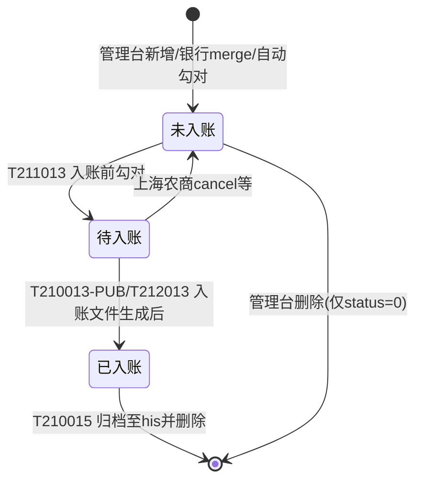

# tbdxfundreceipt 表数据来源与更新逻辑分析

> 分析范围：`/Users/zhoufz/hundsun/lcpt60/git/Sources/app/lcpt-server/sale/lcpt-dxfund` 及关联 Web、SQL 脚本  
> 分析日期：2026-05-18  
> 参考文档：`tbdxfundpayment_分析报告.md`、`基金入账流程分析.md`、`基金资金划拨流程梳理.md`

---

## 一、表的基本信息

### 1.1 表名与业务定位

| 项目 | 说明 |
|------|------|
| 表名 | `tbdxfundreceipt` |
| 中文名 | 基金资金清算复核表 / 资金录入表 |
| 库表注释 | 本表**仅用于**主机清算采用**默认入账**和**默认不入账**模式（`SQUAREMODE`） |
| 历史表 | `tbdxfundhisreceipt`（日终归档） |
| 实体类 | `com.hundsun.lcpt.pub.dxfund.domain.bean.DxFundReceipt` |
| DTO/API | `com.hundsun.lcpt.pub.dxfund.api.dto.DxFundReceiptInfo` |

**DDL 出处**：

```
app/sql/sql-dxfund/pub/dxfund/base/000schema/mysql/001dbstruct_dxfundpub_mysql.table.sql
app/sql/sql-dxfund/pub/dxfund/base/000schema/ora/001dbstruct_dxfundpub_oracle.table.sql
app/sql/sql-dxfund/pub/dxfund/base/000schema/pg/001dbstruct_dxfundpub_pg.table.sql
app/sql/sql-dxfund/pub/dxfund/base/000schema/ob/001dbstruct_dxfundpub_ob.table.sql
```

### 1.2 主键与索引

**主键**（联合主键）：

```
(clear_date, ta_code, prd_code, curr_type, trans_date, busin_code)
```

**索引**：`idx_dxfundreceipt`（见各库 `002dbstruct_dxfundpub_*.index.sql`）

> 说明：`busin_code` 在表注释中为「暂时不填（赎回分红等只支持合并到账）」；管理台标准新增时通常不写 `busin_code`，主键中该字段多为空格 `' '`。分业务划款、上海农商等场景会写入 `0/1/2` 等业务类型码。

### 1.3 字段说明

| 字段名 | 中文名称 | 类型 | 说明 |
|--------|---------|------|------|
| clear_date | 清算日期 | int | 应划款/应入账日期 |
| ta_code | TA代码 | varchar | 登记机构 |
| prd_manager | 产品管理人 | varchar | 来自 `tbdxfundproduct` |
| prd_code | 产品代码 | varchar | 基金产品 |
| curr_type | 币种 | varchar | 如 156-人民币 |
| tot_amt | 收款总额 | numeric(18,2) | 与 `tbdxfundpayment` 勾对金额 |
| trans_date | 交易/清算日期 | int | 录入时对应 payment 的 trans_date |
| oper_no | 操作柜员 | varchar | 管理台录入柜员 |
| liqu_mode | 账务模式 | varchar | `K_DKFS`：0-按产品，1-按TA（现多用 0） |
| deal_status | 处理状态 | varchar | `K_RZBZ`：见下文状态机 |
| auth_status | 授权状态 | varchar | 授权相关 |
| auth_oper | 授权柜员 | varchar | 审核柜员 |
| liqu_dir | 账务方向 | varchar | `K_ZWFX`：0下账 1上账 2冻结 3解冻 |
| square_date | 入账日期 | int | 提前/延后入账日；默认不入账未调整时为 0 |
| busin_code | 业务代码 | varchar | 分业务勾对：0赎回 1分红 2退款等 |
| summary | 摘要 | varchar | 如「自动勾对」 |
| square_mode | 入账复核模式 | varchar | 0-正向勾对，1-反向勾对（与 `SQUAREMODE` 一致） |

---

## 二、表在资金流程中的位置

```
日终 T210110
    └─> tbdxfundpayment（系统汇总应划款）

管理台「入账日调整」/ 银行个性化确认 / 昆仑银行自动勾对
    └─> tbdxfundreceipt（银行录入实际到账、调整入账日）

日终 T211013（入账前）
    └─> receipt ↔ payment 勾对，deal_status → 待入账(1)
    └─> 可选：payment.square_date ← receipt.square_date

日终 T210013-TRANS（交易片区）
    └─> receipt → tbdxfundsquare{1-N}.square_date / check_status

日终 T210013-PUB / T212013（公共片区）
    └─> receipt.deal_status → 已入账(2)

日终 T210015
    └─> 已入账记录 → tbdxfundhisreceipt，并 delete 当前表
```

与 **`tbdxfundpayment`**：通过 `clear_date + prd_code + trans_date (+ tot_amt)` 勾对。  
与 **`tbdxfundsquare{1-N}`**：通过 `clear_date + prd_code + trans_date` 驱动入账日期与勾兑状态。  
与 **`tbdxfundbalancecheck`**：T218013 按 receipt 回写 `square_date`（内部户余额校验）。

---

## 三、数据来源（INSERT / MERGE）

本表**不由日终清算自动从 square 汇总生成**，数据主要来自**人工/半自动录入**及**银行个性化**，底层业务数据参考 **`tbdxfundpayment`**。

### 3.1 管理台「入账日调整」（标准来源，主路径）

| 项目 | 说明 |
|------|------|
| 菜单/交易 | `ifmCRcywDxFundReceiptAdj`（入账日调整） |
| Controller | `DxFundReceiptAdjustController` |
| Service | `DxFundReceiptAdjustService` |
| 路径 | `lcpt-web-manager-dxfund-core/.../ifmCRcywDxFundLrwhMenu/` |

**新增 `addService`**（`DxFundReceiptAdjustService.java` 约 391–455 行）：

1. 从 `tbdxfundproduct` 取 `ta_code、prd_manager、curr_type`
2. 按前端 `transDates`（格式：`transDate$totAmt`）循环 **INSERT**
3. 字段赋值要点：
   - `clear_date`：应入账日期
   - `square_date`：实际入账日（未送则等于 clear_date）
   - `trans_date`：对应 payment 清算日
   - `tot_amt`：划款总额（与 `SQUAREMODE`、`RECEIPT_ADJ_TOTAMT_ADD` 有关）
   - `deal_status = '0'`（未入账）
   - `liqu_mode = '0'`（按产品）
   - `square_mode`：系统参数 `SQUAREMODE`（0 正向 / 1 反向）
4. 重复校验：`checkHasAdded` 按 `ta_code+prd_code+clear_date+curr_type+trans_date` 查重

**批量新增 `addBatchService`**（约 458–517 行）：逻辑类似，`square_date` 取系统日期。

**批量待选数据来源 `getTransDateBatchService`**（约 326–387 行）：

- 查询 `tbdxfundpayment`：`deal_status='0'` 且 `tot_amt>0` 且 `clear_date<=系统日期`
- 且 **不存在** 对应 `tbdxfundreceipt` 记录（`liqu_mode='0'`）
- 即：从**未勾对的划付表**挑选可录入项

**修改 `editService`**（约 559–608 行）：仅 **UPDATE** `square_date`、`tot_amt`（默认不入账时校验与 payment 金额一致）。

**删除 `deleteService`**（约 681–731 行）：仅 `deal_status='0'` 可删。

### 3.2 上海农商：产品清算确认（MERGE）

| 项目 | 说明 |
|------|------|
| 类 | `DxfundPrdClrCfmServiceImpl` |
| 路径 | `lcpt-web-manager-dxfund-bank/.../shnsh/.../DxfundPrdClrCfmServiceImpl.java` |

- **`confirm`**：`merge into tbdxfundreceipt`，数据来自 **`tbdxfundpayment`**（按选中划款明细）
- 参数 `SHNSH_RECEIPT_FLAG=1` 时，按赎回/分红/退款拆 `busin_code`（0/1/2）分别 merge
- 初始 `deal_status`：确认路径多为 `'1'`；拆分路径为 `'0'`
- **`cancel`**：不 delete，将 `deal_status='0'`、`square_date=0`

### 3.3 昆仑银行：自动勾对 INSERT

| 项目 | 说明 |
|------|------|
| 类 | `SquareUtil.dealReceipt` |
| 路径 | `lcpt-dxfund-pub-batch-bootstrap/.../bank/klyh/util/SquareUtil.java`（约 169–248 行） |

- `insert into tbdxfundreceipt ... select ... from tbdxfundpaymentdetail`
- 关联 `tbdxfundproduct`、`tbdxfundprdbankacc`
- `summary='自动勾对'`，`deal_status=RZBZ_NO`，`oper_no=' '`
- 不存在同主键维度记录时才插入

### 3.4 其他引用（只读 / 条件判断，不写表）

| 场景 | 类 | 作用 |
|------|-----|------|
| 划款总额查询 | `DxfundDailySquareService` | `not exists tbdxfundreceipt` 过滤已调整产品 |
| 产品银行账户 | `DxfundPrdBankAccService` | 同上 |
| 批量 T219001（南京/嘉兴等） | `T219001HSAdapter` | 判断是否存在不同 `square_date` 的 receipt |

---

## 四、deal_status 状态流转

字典 **`K_RZBZ`**（`IDict.java`）：

| 值 | 常量 | 含义 |
|----|------|------|
| 0 | `RZBZ_NO` | 未入账 |
| 1 | `RZBZ_DOING` | 待入账 / 处理中 |
| 2 | `RZBZ_OVER` | 已入账 |

### 4.1 状态流转图



### 4.2 各节点对 deal_status 的更新

| 节点 | 类 | 方法/逻辑 | 更新内容 |
|------|-----|-----------|----------|
| **T211013** 入账前 | `T211013HSAdapter` | `updatePaymentDateAll` | 正向：`receipt` 0/2→1（与 payment 金额、日期匹配且 square_date=当日）；反向：payment 存在则 receipt 0/2→1 |
| **T210013-TRANS** | `T210013HSAdapter`（trans） | `updateSquareDate` | **不直接改** receipt.status；读取 `deal_status=1` 的 receipt 更新 **square 表** |
| **T210013-PUB** | `T210013HSAdapter`（pub） | `udpateReceiptStatusAll` | `deal_status` 1→2（`RZBZ_DOING`→`RZBZ_OVER`） |
| **T212013** | `T212013HSAdapter` | 同 pub 逻辑 | 入账日调整场景下同步置 2 |
| **T210015** | `T210015HSAdapter` | `receiptToHis` | `deal_status=2` 归档到 `tbdxfundhisreceipt` 后 **delete** |
| **管理台** | `DxFundReceiptAdjustService` | `addService` | 插入时 `deal_status=0` |
| **上海农商** | `DxfundPrdClrCfmServiceImpl` | `confirm/cancel` | merge 为 1 或回退 0 |

---

## 五、重要字段更新逻辑

### 5.1 square_date（入账日期）

| 时机 | 操作 | 代码出处 |
|------|------|----------|
| 管理台新增 | 前端录入或默认=clear_date | `DxFundReceiptAdjustService.addService` |
| 管理台修改 | UPDATE square_date | `DxFundReceiptAdjustService.editService` |
| T211013 | 同步到 `tbdxfundpayment.square_date`（`UPD_PMT_SQUARE_DATE=1`） | `T211013HSAdapter.updatePaymentDateAll` |
| T210013-TRANS | 同步到 `tbdxfundsquare{n}.square_date`、`check_status` | `T210013HSAdapter.updateSquareDate`（trans 模块） |
| T218013 | 同步到 `tbdxfundbalancecheck.square_date` | `T218013HSAdapter.queryDataAndToHost` |
| 上海农商取消 | 置 0 | `DxfundPrdClrCfmServiceImpl.cancel` |
| 昆仑自动勾对 | INSERT 时写入；后续可 UPDATE | `SquareUtil` |

**正向勾对（SQUAREMODE=0）** 更新 square 表示例（trans `T210013HSAdapter` 约 221–238 行）：

- `square_date > 0`：square 表用 receipt.square_date
- 否则：square 表用 receipt.clear_date

**反向勾对（SQUAREMODE=1）**：

- 遍历全部 receipt（或 deal_status=1），按 receipt 调整 square 的 `square_date`

### 5.2 tot_amt（收款总额）

| 场景 | 逻辑 |
|------|------|
| 管理台新增 | 来自 payment 对应 trans_date 的划款额；`SQUAREMODE=1` 且 `RECEIPT_ADJ_TOTAMT_ADD=0` 时可置 0 |
| 管理台修改 | 默认不入账时需与 `tbdxfundpayment.tot_amt` 一致（±0.001） |
| T211013 校验 | `CHECK_RECEIPT_ADJUST=1` 时，payment 有款但无 receipt 或金额不一致则告警 |
| 上海农商 merge | 来自 payment 或 red_amt/div_amt/refund_amt 分项 |

### 5.3 square_mode

- 写入时取系统参数 **`SQUAREMODE`**（`DxFundReceiptAdjustService.getSquareMode`）
- 与全局勾对模式一致，用于区分正向/反向勾对策略

### 5.4 busin_code（分业务）

- 标准管理台新增：通常不写（主键中为默认空格）
- 参数 **`RECEIPT_SUPPORT_BUSIN=1`** 时，T210013-TRANS 按 busin_code 更新不同 busin 的 square 记录
- 上海农商 `SHNSH_RECEIPT_FLAG`：0赎回 / 1分红 / 2退款

---

## 六、批量节点与代码出处汇总

### 6.1 入账相关批量（lcpt-dxfund）

| 交易码 | 类名 | 模块 | 对 tbdxfundreceipt 的操作 |
|--------|------|------|---------------------------|
| T211013 | `T211013HSAdapter` | pub-batch | 校验、勾对：UPDATE deal_status；联动 payment |
| T210013 | `T210013HSAdapter` | trans-batch | 读 receipt：UPDATE square 表 |
| T210013 | `T210013HSAdapter` | pub-batch | UPDATE deal_status 1→2 |
| T212013 | `T212013HSAdapter` | pub-batch | 同 T210013-pub 状态收尾 |
| T218013 | `T218013HSAdapter` | pub-batch | 读 receipt，UPDATE balancecheck |
| T210015 | `T210015HSAdapter` | pub-batch | INSERT his + DELETE（status=2） |

**完整路径前缀**：  
`app/lcpt-server/sale/lcpt-dxfund/lcpt-dxfund-pub/lcpt-dxfund-pub-batch-bootstrap/src/main/java/com/hundsun/lcpt/dxfund/pub/batch/adapter/T210013/`  
`app/lcpt-server/sale/lcpt-dxfund/lcpt-dxfund-trans/lcpt-dxfund-batch-bootstrap/src/main/java/com/hundsun/lcpt/dxfund/batch/adapter/T210013/`

### 6.2 服务与 API

| 类 | 路径 | 作用 |
|----|------|------|
| `DxFundReceipAndPayMentService` | `lcpt-dxfund-pub-core/.../DxFundReceipAndPayMentService.java` | `select * from tbdxfundreceipt` 按 status 查询 |
| `DxFundReceiptAndPayMentApi` | `lcpt-dxfund-pub-apiservice/.../DxFundReceiptAndPayMentApi.java` | REST：`/dxfundreceiptandpayment/qryreceiptnnfobystatus` |
| `IDxFundReceiptAndPayMentApi` | `lcpt-dxfund-pub-api/.../IDxFundReceiptAndPayMentApi.java` | API 接口定义 |

交易片区通过 **`PubDxFundApiFactory.qryReceiptInfoByStatus`** 调用上述 API（见 trans `T210013HSAdapter.updateSquareDate`）。

### 6.3 管理台（lcpt-web-manager-dxfund）

| 类 | 路径 |
|----|------|
| `DxFundReceiptAdjustController` | `.../controller/.../DxFundReceiptAdjustController.java` |
| `DxFundReceiptAdjustService` | `.../impl/.../DxFundReceiptAdjustService.java` |
| `IDxFundReceiptAdjustService` | `.../interfaces/.../IDxFundReceiptAdjustService.java` |
| `DxFundReceiptDto` | `.../dto/.../DxFundReceiptDto.java` |

### 6.4 银行个性化

| 银行 | 类 | 操作 |
|------|-----|------|
| 上海农商 shnsh | `DxfundPrdClrCfmServiceImpl` | MERGE / UPDATE cancel |
| 昆仑 klyh | `SquareUtil` | INSERT 自动勾对 |

### 6.5 SQL 脚本

| 类型 | 文件 |
|------|------|
| 表结构 | `app/sql/sql-dxfund/pub/dxfund/base/000schema/*/001dbstruct_dxfundpub_*.table.sql` |
| 索引 | `app/sql/sql-dxfund/pub/dxfund/base/000schema/*/002dbstruct_dxfundpub_*.index.sql` |

---

## 七、关键系统参数

| 参数 ID | 含义 | 影响 |
|---------|------|------|
| `SQUAREMODE` | 0-正向勾对（默认不入账）/ 1-反向勾对（默认入账） | 写入 `square_mode`；决定 T211013/T210013 勾对逻辑 |
| `UPD_PMT_SQUARE_DATE` | 是否把 receipt.square_date 同步到 payment | T211013 |
| `CHECK_RECEIPT_ADJUST` | 入账前是否校验已做入账日调整 | T211013 `checkReceiptAdjust` |
| `RECEIPT_SUPPORT_BUSIN` | 是否按业务分笔勾对 | trans T210013 更新 square |
| `RECEIPT_ADJ_TOTAMT_ADD` | 入账日调整新增是否使用前端 tot_amt | 管理台 addService |
| `SHNSH_RECEIPT_FLAG` | 上海农商分业务 receipt | `DxfundPrdClrCfmServiceImpl` |
| `SQUARE_NEED_CHECK_BALANCE` | 是否内部户余额校验 | T218013 / T210013 |

---

## 八、典型 SQL 模式（便于排查）

### 8.1 管理台新增（HsSqlString 生成）

```sql
INSERT INTO tbdxfundreceipt (
  clear_date, square_date, curr_type, prd_code, tot_amt,
  oper_no, trans_date, liqu_mode, deal_status, ta_code,
  prd_manager, square_mode
) VALUES (?, ?, ?, ?, ?, ?, ?, '0', '0', ?, ?, ?);
```

### 8.2 T211013 正向勾对（deal_status → 1）

```sql
UPDATE tbdxfundreceipt
   SET deal_status = '1'
 WHERE deal_status IN ('0','2')
   AND EXISTS (
         SELECT 1 FROM tbdxfundpayment
          WHERE tbdxfundreceipt.prd_code = prd_code
            AND tbdxfundreceipt.tot_amt = tot_amt
            AND clear_date = tbdxfundreceipt.clear_date
            AND trans_date = tbdxfundreceipt.trans_date
            AND deal_status = '0'
       )
   AND square_date = ?;  -- 系统日期
```

### 8.3 T210013-PUB 入账完成（deal_status → 2）

```sql
UPDATE tbdxfundreceipt
   SET deal_status = '2'
 WHERE deal_status = '1';
```

### 8.4 T210015 归档

```sql
INSERT INTO tbdxfundhisreceipt
SELECT ?, a.* FROM tbdxfundreceipt a WHERE a.deal_status = '2';

DELETE FROM tbdxfundreceipt WHERE deal_status = '2';
```

---

## 九、与 tbdxfundpayment 勾对关系小结

| 勾对模式 | SQUAREMODE | receipt 角色 | 要点 |
|----------|------------|--------------|------|
| 正向 | 0 | 银行录入 TA 实际到账，与系统 payment 金额一致才进入待入账 | tot_amt 需匹配；未录入则 T211013 可告警 |
| 反向 | 1 | 默认以系统 payment 为准；receipt 主要调整入账日 | 有 payment 即可将 receipt 置待入账；square_date 驱动入账 |

关联键（常用）：

```
tbdxfundreceipt.clear_date  = tbdxfundpayment.clear_date
tbdxfundreceipt.prd_code    = tbdxfundpayment.prd_code
tbdxfundreceipt.trans_date  = tbdxfundpayment.trans_date
tbdxfundreceipt.tot_amt     = tbdxfundpayment.tot_amt   -- 正向勾对
```

---

## 十、注意事项与常见问题

1. **表仅服务于默认入账/不入账**：联机清算模式（`ONLINELIQUMODE`）下，批量可能跳过 payment/receipt 状态修改（见 trans `T210013HSAdapter`）。
2. **主键含 busin_code**：标准单笔调整与分业务、上海农商并存时，注意主键维度，避免日终归档主键冲突（参见 `DxFundReceiptAdjustService` V6.0.0.10 修改说明）。
3. **删除策略**：管理台仅允许删除 `deal_status=0`；已入账数据靠 **T210015** 归档删除，不宜手工清表。
4. **square_date=0**：表示未做提前/延后调整；正向模式下可能 fallback 为 `clear_date` 写入 square 表。
5. **数据源头**：receipt 的业务金额语义来自 **T210110 生成的 tbdxfundpayment**，receipt 本身不汇总 square/transcfm。

---

## 十一、相关文档索引

| 文档 | 路径 |
|------|------|
| 基金入账流程 | `reference/基金入账流程分析.md` |
| 资金划付表 | `reference/tbdxfundpayment_分析报告.md` |
| 资金清算 square | `reference/tbdxfundsquare_分析报告.md` |
| 资金划拨总览 | `reference/基金资金划拨流程梳理.md` |

---

*文档根据 lcpt-dxfund 工程源码梳理，若后续新增银行个性化或节点，请以 `grep tbdxfundreceipt` 结果为准增量维护。*
