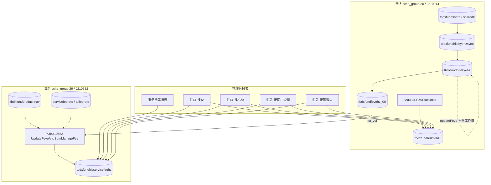

# 基金代销服务费报表梳理

## 一、概述

基金代销服务费相关管理台报表分为**两条产品线**，共用同一套批量汇总数据（`tbdxfundhisservicefeehz` 等），但菜单、Service、展示粒度不同：

| 类型 | 菜单名称 | 菜单码 | 基线状态 | 汇总/展示主维度 |
|------|----------|--------|----------|-----------------|
| **服务费率报表** | 基金代销服务费率报表 | `ifmCDyglDxFundSFeeGather` | **基线已启用** | 产品 + 机构 + 日期（明细/费率） |
| 服务费汇总-按TA | 基金代销服务费汇总报表-按TA | `ifmCDyglDxFundSFeeGatherTA` | 基线注释，需增量下发 | TA |
| 服务费汇总-按机构 | 基金代销服务费汇总报表-按机构 | `ifmCDyglDxFundSFeeGatherBranc` | 基线注释，需增量下发 | 机构（菜单码 Branc） |
| 服务费汇总-按客户经理 | 基金代销服务费汇总报表-按客户经理 | `ifmCDyglDxFundSFeeGatherKhjl` | 基线注释，需增量下发 | 客户经理 |
| 服务费汇总-按管理人 | 基金代销服务费汇总报表-按管理人 | `ifmCDyglDxFundSFeeGatherMgr` | 增量下发（T202606291178，如 hbyh） | 产品管理人（见**第七节**字段溯源） |

父菜单均为 `ifmCDyglDxfundOther`（报表管理 → 其他类报表）。

---

## 二、菜单体系与关系

### 2.1 两条产品线的定位

```
                    ┌─ 批量 J210582 → tbdxfundhisservicefeehz（销售费/尾佣）
                    │  批量 J210014 → tbdxfundhiskhjlhz0（交易手续费）
                    │
  ifmCDyglDxFundSFeeGather ──────► 服务费率报表（基线自带）
  （DxFundSFeeGatherTransService）     · 按 产品+机构+日期 查费率与费用
                                      · 展示 sale_fee_rate / trailing_fee_rate
                                      · 可按 prdManager 筛选，行级带管理人
                                      · 一般不合并手续费（不含 khjlhz0）

  ifmCDyglDxFundSFeeGatherTA    ───► 汇总报表-按TA（增量下发）
  ifmCDyglDxFundSFeeGatherBranc ──► 汇总报表-按机构
  ifmCDyglDxFundSFeeGatherKhjl  ──► 汇总报表-按客户经理
  ifmCDyglDxFundSFeeGatherMgr   ──► 汇总报表-按管理人（增量，T202606291178）
  （DxFundSFeeGather*Service）       · UNION 服务费表 + 手续费表
                                      · 按 TA/机构/客户经理/管理人 聚合
                                      · 含认/申/赎/定投手续费、总费用
```

### 2.2 对比摘要

| 对比项 | 服务费率报表 `SFeeGather` | 服务费汇总报表 `SFeeGather{TA\|Branc\|Khjl\|Mgr}` |
|--------|---------------------------|---------------------------------------------|
| 开发时间 | 较早（xingch，约 2021） | 较晚（gaocc，T202405277343，2024；管理人 zhoufz，T202606291178） |
| Service | `DxFundSFeeGatherTransService` | `DxFundSFeeGatherTAService` 等 + `DxFundSFeeGatherMgrService` |
| 主数据表 | `tbdxfundhisservicefeehz` | `tbdxfundhisservicefeehz` **UNION** `tbdxfundhiskhjlhz0` |
| 展示粒度 | 产品 × 机构 × 日期，带费率 | 按 TA / 机构 / 客户经理 / **管理人**汇总 |
| 手续费 | 不含（或极少扩展逻辑） | 含认购/申购/赎回/定投手续费 |
| 产品管理人 | 查询条件 + 结果列 `prd_manager` | **按管理人报表**：GROUP BY `prd_manager`；其余维度多作筛选 |
| 基线脚本 | **已写入** `ifmmanage_menu_dxfund.sql` | TA/机构/客户经理基线注释；**管理人走银行增量**（如 `spsql-dxfund/...-BANK-hbyh.sql`） |

### 2.3 使用场景建议

- **查某产品在某机构的服务费率、销售服务费/尾佣明细** → 用「服务费率报表」。
- **按 TA / 机构 / 客户经理做管理统计，且要含交易手续费合计** → 用三个「汇总报表」之一。
- **按产品管理人做汇总统计** → 用「汇总报表-按管理人」`ifmCDyglDxFundSFeeGatherMgr`（增量菜单；字段溯源见第七节）。

---

## 三、整体架构

```
日终 J210014（DXFUND210014 / PUB210014）
  ├─ share/sharedtl → hisfeyehz → tbdxfundfeyehz_00（算费快照）
  └─ 交易确认汇总（认/申/赎/定投手续费）→ tbdxfundhiskhjlhz0

日启 J210582（PUB210582 / DXFUND210582）
  ├─ updateFeye：hisfeyehz 补非工作日保有量
  └─ sumManageFee：feyehz_00 + product.nav + 费率 → tbdxfundhisservicefeehz

管理台
  ├─ ifmCDyglDxFundSFeeGather        → 产品级费率/费用明细
  └─ ifmCDyglDxFundSFeeGather{TA|Branc|Khjl|Mgr} → 维度汇总（含手续费）
```

报表数据依赖批量节点预先汇总，**非联机实时计算**。

---

## 四、批量数据生成

### 4.1 日启 J210582（保有量补数 + 服务费/尾佣）

| 项 | 值 |
|---|---|
| 调度组 | `29`（日启） |
| 节点码 | `J210582` |
| 公共片区 | `PUB210582` → `com.hundsun.lcpt.dxfund.pub.batch.adapter.T210582.T210582HSAdapter` |
| 交易片区 | `DXFUND210582` → 交易侧 `T210582HSAdapter`（昨日收益/盈亏，**不写服务费**） |

#### 4.1.1 公共片区调用链

```
T210582HSAdapter.action（PUB210582）
  ├─ DxFundPrdIncrease.collectData          // 产品涨幅（参数 FUND_INCREASE_STAT，与服务费无关）
  └─ UpdateFeyeAndSumManageFee.collectData  // 保有量更新 + 销售服务费/尾随佣金
        ├─ updateFeye
        │     ├─ restockNonWorkDayByl(tbdxfundhisfeyehz)   // 用上一系统工作日保有量补自然日
        │     └─ [FEYEHZ_BY_CLIENT_MANAGER=1]
        │           updateFeeemploye(tbdxfundhisfeyeemployeehz)
        └─ if CAL_SERVICE_FEE=1
              ├─ IS_USE_ALLFEERATE_SET=1 → sumManageFeeNew  // 费率取 tbdxfundallfeerate
              └─ else → sumManageFee → servicefeeHz(...)    // 费率取 tbdxfundservicefeerate（8/9）
                    └─ [FEYEHZ_BY_CLIENT_MANAGER=1] sumFeeemploye
```

**核心类路径**：

- `lcpt-dxfund-pub-batch-bootstrap-adapter/.../T210582/T210582HSAdapter.java`
- `lcpt-dxfund-pub-batch-bootstrap-adapter/.../T210582/UpdateFeyeAndSumManageFee.java`

#### 4.1.2 `updateFeye`：历史保有量补非工作日（`tbdxfundhisfeyehz`）

> **不**从份额明细重新汇总，也**不**改写 `tbdxfundfeyehz_00`；仅对正式保有量表 `tbdxfundhisfeyehz` 做缺口补数与净值回刷。

处理步骤（`restockNonWorkDayByl`）：

1. 删除 `(prevDate, initDate)` 之间已有记录（支持重跑）。
2. 取系统上一工作日 `prevDate` 的保有量行，按自然日循环  
   `nextDate = prevDate+1 .. initDate-1`，整行复制插入（`tot_vol/client_num` 等同周五）。
3. 用 `tbdxfundproduct.nav` 回刷净值（`interest_way='0'` 等条件；可用 `T210582_SUMDATE_BEFORE_DAYS` 缩范围）。

例：周一跑批、`prevDate=周五` → 插入周六、周日保有量，份额与周五一致。

#### 4.1.3 `sumManageFee` / `sumManageFeeNew`：写入 `tbdxfundhisservicefeehz`

在 **产品工作日**（`tbdxfundprdtransday`，`date_type` 为基金产品工作日）且已配置费率时执行：

| 步骤 | 处理 |
|------|------|
| 1. 清当日待计提 | `delete tbdxfundhisservicefeehz where sum_date>=initDate and status=待计提` |
| 2. 取保有份额 | 从 **`tbdxfundfeyehz_00`** 拷贝 `tot_vol` 等；`sum_date` 记为当日 `initDate`；净值取 **`tbdxfundproduct.nav`** |
| 3. 取费率 | 旧：`tbdxfundservicefeerate`，`fee_type='8'`销售服务费 / `'9'`尾随佣金；新：`tbdxfundallfeerate`业务 173/171 |
| 4. 算费 | 默认（市值年化日计提，见下） |
| 5. 补产品工作日空隙 | 将当日已算好的行（含份额/净值/费率/费用金额）复制到 `(上一产品工作日, 当日)` 之间的自然日 |

**默认计算公式**（`UpdateFeyeAndSumManageFee` 中 update 语句）：

```text
days = 闰年 ? 366 : 365
sale_fee     = round(tot_vol * nav * sale_fee_rate     / days, 2)   -- SaleFeeCalcMode=1 时不乘 nav
trailing_fee = round(tot_vol * nav * trailing_fee_rate / days, 2)
-- 产品扩展 prd_fee_calc_mode=2 时：改为 tot_vol * rate / days（按份额，不乘净值）
```

**取数时点说明**：

| 项 | 实际来源 | 与「T / T-1」对照 |
|----|----------|-------------------|
| 份额 `tot_vol` | `tbdxfundfeyehz_00`（日终对上一系统工作日保有量快照） | ≈ **T-1（或上一工作日日终）保有份额** |
| 净值 `nav` | 写入服务费时取 **`tbdxfundproduct.nav`（当前产品净值）** | 偏 **T 日（日启行情后）净值**，非整条链路强制 T-1 净值 |
| 费用行 `sum_date` | `sysArg.initDate` | **T 日** |
| 管理台按 TA 汇总 | `sum(sale_fee/trailing_fee) group by ta_code` | 与「基金 TA T 日 = sum(产品…)」一致 |

#### 4.1.4 服务费侧非工作日补数

1. 临时表 `tbdxfundprdlstdaytmp`：取「今日为产品工作日」产品的上一产品工作日。
2. 先算好 **当日（initDate）** 服务费。
3. `for prePrdTransDay+1 .. initDate-1`：把当日记录**整行复制**到缺口日（默认 `sale_fee/trailing_fee/tot_vol/nav/费率` 与当日一致）。
4. 参数 `INSERT_DXFUNDHISSERVICEFEEHZ_BY_START_DATE=1` 时：补日后可按该自然日是否已有生效费率回写费率并重算金额。

例：周五为上一产品工作日、周一为今日 → 为周六、周日补入与周一相同金额的服务费行（默认行为）。

---

### 4.2 日终 J210014（保有量上游 + 手续费）

| 项 | 值 |
|---|---|
| 调度组 | `30`（日终） |
| 节点码 | `J210014` |
| 保有量任务 | `BNFEYEHZStatsTask`（交易片区汇总 → sync；公共片区合并写 his / `_00`） |
| 手续费任务 | `BNKHJLHZ0StatsTask`（交易片区）→ **`tbdxfundhiskhjlhz0`** |

公共片区 `PUB210014` 合并各交易片区 sync 文件后：

1. `feyehz` → 写入正式历史保有量 **`tbdxfundhisfeyehz`**；
2. `feyeHz00` → 灌入算费临时表 **`tbdxfundfeyehz_00`**（供次日日启 J210582 使用）；
3. 手续费合并进 **`tbdxfundhiskhjlhz0`**。

#### 4.2.1 `tbdxfundfeyehz_00` 数据来源与处理

| 项 | 说明 |
|----|------|
| 表角色 | **份额余额汇总临时表**，供日启 `UpdateFeyeAndSumManageFee` 取数算销售服务费/尾佣；**非**长期历史主表 |
| 写入节点 | **日终 J210014 公共片区** `BNFEYEHZStatsTask.feyeHz00`（**不是** J210582） |
| 正式历史表 | `tbdxfundhisfeyehz`（由同节点 `feyehz` 写入）；日启 `updateFeye` 只补 `hisfeyehz` 的自然日缺口 |
| 上游（交易片区） | `tbdxfundshare{N}` 或 `tbdxfundsharedtl{N}`（参数 `SHAREDTL_FEYEHZ`）→ `tbdxfundhisfeyehzsync` → 公共片区导入 |
| 写入逻辑 | `truncate tbdxfundfeyehz_00` 后，从 `tbdxfundhisfeyehz` + `tbdxfundproduct` 过滤拷入 |

**公共片区 `feyeHz00` 过滤要点**：

- 排除终止产品等（`prd_status<>'3'`，部分结束日例外）；
- 默认：`sum_date = initDate`，可选要求 `sum_date = nav_date`（参数 `MANAGEFEE_COLLECT_WITHOUT_NAV`）；
- MRF 场景可由 `IS_MRF_FEYE` 放宽日期条件。

**交易片区保有量汇总维度**（写入 sync，最终进 `hisfeyehz` / `_00`）：

- 默认：`sum_date(=initDate) + sum_flag + client_type + prd_code + open_branch + ta_code`，`sum(tot_vol)` 等；
- `SHAREDTL_FEYEHZ` 含明细模式时，可按交易机构/归属机构从 `sharedtl` 汇总；
- `FEYEHZ_BY_CLIENT_MANAGER=1` 时另汇总客户经理表 `tbdxfundhisfeyeemployeehz*`。

**命名说明**：

- 后缀 `_00`：相对 `hisfeyehz` 的**算费用临时快照**；
- 字段 `table_num='00'`（若出现在分片场景）：分片汇总后的合并行，与表名 `_00` 含义不同。

**与 J210582 关系**：

```
日终 T210014：share/sharedtl → hisfeyehz → feyehz_00（快照）
日启 T210582：feyehz_00 + product.nav + 费率 → hisservicefeehz（当日算费 + 非工作日复制）
             hisfeyehz ← updateFeye 仅补非工作日行（不刷新 _00）
```

---

### 4.3 关键参数

| 参数 | 归属 | 含义 | 默认值 |
|------|------|------|--------|
| `CAL_SERVICE_FEE` | 公共 `belong_type=0` | 0-不统计，1-统计销售服务费/尾佣 | 基线 `0`，下发时通常为 `1` |
| `IS_USE_ALLFEERATE_SET` | 基金 | 是否走新版费率汇总（`tbdxfundallfeerate`） | `0` |
| `210582_CLIENTTYPE` | 基金 | 是否按客户类型更新费率 | `0` |
| `IS_FLOAT_MAN_FEE` | 基金 | 浮动管理费尾佣 | `0` |
| `GLFHZ_FLAG` | 基金 | 管理费汇总模式 | 按需 |
| `FEYEHZ_BY_CLIENT_MANAGER` | 基金 | 是否按客户经理汇总份额 | 按需 |
| `SHAREDTL_FEYEHZ` | 基金 | 保有量从 share / sharedtl 及机构维度 | `0` |
| `MANAGEFEE_COLLECT_WITHOUT_NAV` | 基金 | `_00`/算费是否必须 `sum_date=nav_date` | 按需 |
| `SaleFeeCalcMode` | 公共 | 销售服务费是否乘净值（1-不乘） | `0` |
| `INSERT_DXFUNDHISSERVICEFEEHZ_BY_START_DATE` | 基金 | 补非工作日后是否按生效费率重算 | `0` |
| `T210582_SUMDATE_BEFORE_DAYS` | 基金 | 刷净值时缩小日期范围（性能） | `0` |

---

### 4.4 三条计费需求与实现对照（单独说明）

> 需求表述中的「基金 TA T 日费用」在管理台侧通常对 `tbdxfundhisservicefeehz` 按 `ta_code`、`sum_date=T` 做 `sum`；批量落表粒度是 **产品 × 机构 × 日期**，TA 为汇总维度。

#### （1）销售服务费公式

**需求**：基金 TA T 日销售服务费 = sum\[归属该 TA 下产品 T-1 日份额明细汇总 × 产品 T-1 日净值 × 销售服务费费率 / 365\]

| 要点 | 实现情况 | 说明 |
|------|----------|------|
| sum（按 TA 下产品） | **满足** | 批量按产品（及机构等）计费；报表按 TA 聚合即得 |
| 份额 = T-1 日份额明细汇总 | **基本满足** | 份额来自日终汇总进 `_00` 的保有量，上游为 `tbdxfundshare`/`sharedtl`，时点为上一系统工作日日终快照 |
| 净值 = T-1 日净值 | **部分满足** | 算费时净值取 **`tbdxfundproduct.nav`（日启当前净值）**，不是强制取 T-1 净值字段 |
| × 费率 / 365 | **满足（默认）** | `tot_vol * nav * sale_fee_rate / days`；闰年 **`days=366`**；`SaleFeeCalcMode=1` 或 `prd_fee_calc_mode=2` 时公式会变 |

**结论**：**默认路径下「份额×净值×费率/365」成立，整体部分满足**——份额偏 T-1 保有、净值偏当日产品 nav、闰年用 366。

#### （2）尾随佣金公式

**需求**：基金 TA T 日尾随佣金 = sum\[归属该 TA 下产品 T-1 日份额明细汇总 × 产品 T-1 日净值 × 尾随佣金费率 / 365\]

| 要点 | 实现情况 | 说明 |
|------|----------|------|
| 与销售服务费同源份额/净值 | **满足** | 同表同日 `tot_vol`、`nav` |
| × trailing_fee_rate / 365 | **满足（默认）** | `tot_vol * nav * trailing_fee_rate / days`；闰年 366；`prd_fee_calc_mode=2` 时不乘净值 |

**结论**：与（1）相同，**默认公式满足，时点/闰年为部分差异**。

#### （3）非工作日 / 非开放日按前一工作日保有市值补算

**需求**：非工作日或非开放日，按前一工作日或开放日的保有份额市值计算当日销售服务费和尾随佣金；如周六、周日在周一日启时按周五保有份额市值补入。

| 要点 | 实现情况 | 说明 |
|------|----------|------|
| 自然日循环补数 | **满足** | 保有量：`prevDate+1 .. initDate-1` 复制周五行；服务费：上一产品工作日与今日之间同样循环 |
| 周一补周五～周日 | **满足（场景对齐）** | 跨周末日启会写入周六、周日行 |
| 按「前一工作日保有份额市值」重算每日费用 | **部分满足** | 服务费默认是把 **周一算好的 sale_fee/trailing_fee 整行复制**到周六日，效果等于「用同一套份额×净值×费率结果填缺口日」，**不是**每个自然日再单独取该日净值重算 |
| 仅产品开放日首次算费 | **满足** | insert 时要求当日在 `tbdxfundprdtransday` |

**结论**：**补数机制满足「周一补周末」类需求；默认实现是「复制当日已算费用」，而非逐日独立按前一工作日市值重算。** 若要求缺口日必须按各自生效费率重算，需开 `INSERT_DXFUNDHISSERVICEFEEHZ_BY_START_DATE=1`。

#### 4.4.1 符合度一览

| 序号 | 需求摘要 | 符合度 | 主要差异 |
|------|----------|--------|----------|
| 1 | 销售服务费 = sum(份额×净值×销售费率/365) | **部分满足** | 默认公式一致；份额≈上一日终保有，净值用当日 product.nav；闰年 366 |
| 2 | 尾随佣金 = sum(份额×净值×尾佣费率/365) | **部分满足** | 同上 |
| 3 | 非工作日按前一工作日保有市值补算（如周一补周五～周日） | **部分满足～满足** | 有补数且场景对齐；默认复制当日算费结果，非逐日独立重算 |

---

## 五、核心数据表

### 5.1 tbdxfundhisservicefeehz

销售服务费、尾随佣金、份额余额等。主要字段：`sum_date`、`sum_flag`、`branch_no`、`prd_code`、`tot_vol`、`nav`、`sale_fee`、`sale_fee_rate`、`trailing_fee`、`trailing_fee_rate`、`over_tail_fee`、`con_tail_fee`。  
**写入**：日启 J210582（`UpdateFeyeAndSumManageFee`）。

### 5.2 tbdxfundhisfeyehz / tbdxfundfeyehz_00

| 表 | 说明 | 写入 | 使用 |
|----|------|------|------|
| `tbdxfundhisfeyehz` | 份额余额汇总**历史正式表** | 日终 J210014 `BNFEYEHZStatsTask.feyehz`；日启 J210582 `updateFeye` 补非工作日 | 历史保有量、部分报表 |
| `tbdxfundfeyehz_00` | 份额余额汇总**临时表**（算费快照） | 日终 J210014 `feyeHz00`（从 his 过滤拷贝） | 日启 J210582 从该表取 `tot_vol` 写入服务费表 |
| `tbdxfundhisfeyehzsync` | 交易片区→公共片区中转 | 日终交易片区 BNFEYEHZStatsTask | 公共片区导入 |

上游明细：`tbdxfundshare{N}` / `tbdxfundsharedtl{N}`（见 4.2.1）。

### 5.3 tbdxfundhiskhjlhz0

交易手续费汇总。主要字段：`sum_date`、`ta_code`、`branch_no`、`client_manager`、`allot_charge`、`sub_charge`、`red_charge`、`auto_charge` 等。  
**写入**：日终 J210014（`BNKHJLHZ0StatsTask`）。

---

## 六、管理台实现对照

| 报表 | 菜单码 | 子交易-查询 | 子交易-下载 | Service | REST 前缀 | Excel 模板 |
|------|--------|-------------|-------------|---------|-----------|------------|
| 服务费率报表 | `ifmCDyglDxFundSFeeGather` | `ifmCDyglDxFundSFeeGatherQry` | `ifmCDyglDxFundSFeeGatherDwn` | `DxFundSFeeGatherTransService` | `/ifmCDyglDxFundSFeeGather/` | `ifmCDyglDxFundSFeeGatherTemp.xls` |
| 汇总-按 TA | `ifmCDyglDxFundSFeeGatherTA` | `ifmCDyglDxFundSFeeGatherTAQry` | `ifmCDyglDxFundSFeeGatherTADwn` | `DxFundSFeeGatherTAService` | `/ifmCDyglDxFundSFeeGatherTA/` | `ifmCDyglDxFundSFeeGatherTATemp.xls` |
| 汇总-按机构 | `ifmCDyglDxFundSFeeGatherBranc` | `ifmCDyglDxFundSFeeGatherBrancQry` | `ifmCDyglDxFundSFeeGatherBrancDwn` | `DxFundSFeeGatherBranchService` | `/ifmCDyglDxFundSFeeGatherBranc/` | `ifmCDyglDxFundSFeeGatherBrancTemp.xls` |
| 汇总-按客户经理 | `ifmCDyglDxFundSFeeGatherKhjl` | `ifmCDyglDxFundSFeeGatherKhjlQry` | `ifmCDyglDxFundSFeeGatherKhjlDwn` | `DxFundSFeeGatherKhjlService` | `/ifmCDyglDxFundSFeeGatherKhjl/` | `ifmCDyglDxFundSFeeGatherKhjlTemp.xls` |
| 汇总-按管理人 | `ifmCDyglDxFundSFeeGatherMgr` | `ifmCDyglDxFundSFeeGatherMgrQry` | `ifmCDyglDxFundSFeeGatherMgrDwn` | `DxFundSFeeGatherMgrService` | `/ifmCDyglDxFundSFeeGatherMgr/` | `ifmCDyglDxFundSFeeGatherMgrTemp.xls` |

**包路径**：`com.hundsun.lcpt.dxfund.*.ifmDxfundReportManage.ifmCDyglDxfundOther`

**前端路由**（console-dxfund-vue）：

```
/console-dxfund-vue/ifmDxfundReportManage/ifmCDyglDxfundOther/ifmCDyglDxFundSFeeGather/
/console-dxfund-vue/ifmDxfundReportManage/ifmCDyglDxfundOther/ifmCDyglDxFundSFeeGatherTA/
/console-dxfund-vue/ifmDxfundReportManage/ifmCDyglDxfundOther/ifmCDyglDxFundSFeeGatherBranc/
/console-dxfund-vue/ifmDxfundReportManage/ifmCDyglDxfundOther/ifmCDyglDxFundSFeeGatherKhjl/
/console-dxfund-vue/ifmDxfundReportManage/ifmCDyglDxfundOther/ifmCDyglDxFundSFeeGatherMgr/
```

Vue 页面通过 REST 接口查询/下载；`tsys_subtrans.rel_serv` 中的 `lccpxsqk` 为历史占位，实际走 Spring Controller。

### 6.1 服务费率报表查询特点

`DxFundSFeeGatherTransService.getHss` 以 `tbdxfundhisservicefeehz` 为主表，关联 `tbbranch`、`tbdxfundproduct`（及可选 `tbprdmanager`），按 **产品 + 机构 + 汇总日期** 展示：

- 销售服务费 `sale_fee`、尾随佣金 `trailing_fee` 及对应**费率**；
- 产品管理人 `prd_manager` / `manager_shortname`（可作查询条件）；
- 支持按年/季/月等时间维度、客户类型、产品属性、浮动管理费标志等筛选；
- 参数 `IS_SHOW_STATIC_DIMENSION=1` 时可走汇总统计分支 `getSummaryHss`。

**不含** `tbdxfundhiskhjlhz0` 的交易手续费合并逻辑，与「汇总报表」是互补关系。

### 6.2 汇总报表各维度 SQL 差异

四类 Service 均采用 **UNION ALL** 合并 `tbdxfundhisservicefeehz`（尾佣/销售费）与 `tbdxfundhiskhjlhz0`（手续费），差异在 GROUP BY 主键：

| 维度 | 主关联表 | GROUP BY 主字段 |
|------|----------|-----------------|
| 按 TA | `tbbranch` + 汇总子查询 | `ta_code`（`selectAndGroupField` 固定带 `,ta_code`） |
| 按机构 | `tbbranch` + 汇总子查询 | `branch_no` |
| 按客户经理 | `tbclientmanager` + 汇总子查询 | `client_manager` |
| 按管理人 | `tbbranch` + 汇总子查询 | `prd_manager`（来自 `tbdxfundproduct`；产品下钻时附带 `ta_code/prd_code/prd_name/prd_attr/nav`） |

公共查询条件：`startDate/endDate`、`taCode`、`branchNo`、`prdCode`、`clientType`、`sumFlag`（默认 `1` 开户机构）、`isSumDate`（是否按日期）、`isPrdDimension`（是否下钻产品）；按管理人另支持 `prdManager` 筛选。

### 6.3 应答主要指标

**服务费率报表**：产品代码、TA、机构、汇总日期、销售/尾随费率及金额、期末份额、产品管理人、币种等。

**汇总报表**：份额总数、销售服务费、尾随佣金（含浮动管理费拆分）、认/申/赎/定投笔数金额及手续费、总费用 `tot_all_fee`。

---

## 七、按管理人报表：页面字段溯源（`ifmCDyglDxFundSFeeGatherMgr`）

> 依据：前端 `ifmCDyglDxFundSFeeGatherMgr.vue`；后端 `DxFundSFeeGatherMgrService`（`getMgrHss` + `datasetTranslateRjKhjl`）；批量写入见第四节、第十二～十三章。  
> 任务单：T202606291178 / IFMS6.0V202607.03.000；修改人 zhoufz。

### 7.1 调用链与 SQL 骨架

```text
Vue h-datagrid
  url=/ifmCDyglDxFundSFeeGatherMgr/ifmCDyglDxFundSFeeGatherMgrQry
    → DxFundSFeeGatherMgrController.query
      → DxFundSFeeGatherMgrService.queryService
            ├─ getMgrHss(dto) 生成 selectSql / countSql
            ├─ session.getDataSetForPage(...)
            └─ datasetTranslateRjKhjl(...)  格式化 + 衍生列 + 缓存补名称
```

**SQL 结构**（`getMgrHss`，与按机构一致，GROUP BY 改为 `prd_manager`）：

```text
SELECT f.*, a.branch_no, a.up_branch
FROM (
  SELECT [sum_date,] branch_no, prd_manager [, ta/prd/attr/nav],
         sum(tot_vol), sum(sumtotal), sum(sale_fee), sum(trailing_fee),
         sum(over_tail_fee), sum(con_tail_fee),
         sum(allot_*), sum(sub_*), sum(red_*), sum(auto_*), sum(invest_amt), sum(auto_charge)
  FROM (
    -- 上半段：服务费/尾佣/份额（手续费列写死 0）
    SELECT ... FROM tbdxfundhisservicefeehz b, tbdxfundproduct c
     WHERE b.prd_code = c.prd_code + whereStr
     GROUP BY [sum_date,] b.branch_no, c.prd_manager [, 产品维]
    UNION ALL
    -- 下半段：认/申/赎/定投手续费（服务费列写死 0）
    SELECT ... FROM tbdxfundhiskhjlhz0 d, tbdxfundproduct e
     WHERE d.prd_code = e.prd_code + whereStr
     GROUP BY [sum_date,] d.branch_no, e.prd_manager [, 产品维]
  ) tt1
  GROUP BY [sum_date,] tt1.branch_no, tt1.prd_manager [, 产品维]
) f
LEFT JOIN tbbranch a ON a.branch_no = f.branch_no_tt1
WHERE 机构权限（internal_branch）+ 可选 branch_no
ORDER BY [sum_date desc,] a.branch_no, f.prd_manager
```

| 维度开关 | 效果 |
|----------|------|
| `isSumDate=1` | SELECT/GROUP 带 `sum_date`；结果列 `sumDateName` 可见 |
| `isPrdDimension=1` | SELECT/GROUP 额外带 `ta_code,prd_code,prd_name,prd_attr,nav`；对应列可见 |
| `sumFlag` 默认 `1` | where 条件作用于两张汇总表的 `sum_flag`（开户机构） |
| `IS_FLOAT_MAN_FEE=1` | 翻译层拆分固定/或有/超额尾佣，总费用含定投手续费 |

### 7.2 结果列字段溯源总表

前端 key 为驼峰；后端 Dataset 多为下划线；JSON 序列化后前端取驼峰。

| 界面列名 | Vue `key` | 后端字段 / 赋值点 | SQL 直接来源 | 批量落表 / 更上游 | 备注 |
|----------|-----------|-------------------|--------------|-------------------|------|
| 汇总日期 | `sumDateName` | `sum_date_name`←`DateUtil.dateTo10(sum_date)` | `b/d.sum_date`（`isSumDate=1` 才选出） | 服务费：J210582 写 `initDate`；手续费：J210014 写确认日 | 默认列隐藏；选「按日期汇总」后显示 |
| 所属分行代码 | `upBranchName` | `up_branch_name`←`up_branch`+`ManageUtil.getBranchName` | 外层 `tbbranch.up_branch` | 机构树 `tbbranch` | `code:名称` |
| 所属支行代码 | `branchNoName` | `branch_no_name`←`branch_no`+机构缓存 | 汇总表 `branch_no` + 外层 `a.branch_no` | 服务费/手续费表机构；权限按 `internal_branch` | `code:名称` |
| 产品管理人 | `prdManagerName` | `prd_manager_name`←`PrdManagerInfoCache.getPrdManagerName` | **`tbdxfundproduct.prd_manager`**（GROUP BY 主键） | 产品信息设置维护 | 非汇总表字段；`code:名称` |
| TA代码 | `taName` | `ta_name`←`ta_code`+`DxFundTAInfoCache` | 产品维：`c/e.ta_code` | `tbdxfundproduct.ta_code` | 仅 `isPrdDimension=1`；否则翻译层置空 |
| 产品代码 | `prdCode` | `prd_code`←`ManageUtil.prdCodeConvert2` | 产品维：`c/e.prd_code` | 产品表 | 同上 |
| 产品名称 | `prdName` | SQL 直出 `prd_name`（翻译层未改） | 产品维：`tbdxfundproduct.prd_name` | 产品表 | 同上 |
| 基金类型 | `prdAttrName` | `prd_attr_name`←字典 `K_CPSX` | 产品维：`prd_attr` | 产品表 | 同上 |
| 份数总数 | `totVolName` | `tot_vol_name`←`format(tot_vol)` | 上半段 `sum(b.tot_vol)`；下半段 `0` | **`tbdxfundhisservicefeehz.tot_vol`** ← J210582 自 `tbdxfundfeyehz_00`（上游份额见 4.2） | 保有份额汇总 |
| 产品净值 | `navName` | `nav_name`←`format(nav,8)` | 产品维：`tbdxfundproduct.nav` | 产品当前净值；**非**服务费表行内 nav 聚合 | 仅产品维；非产品维置空 |
| 销售服务费 | `saleFeeName` | `sale_fee_name`←`format(sale_fee)` | 上半段 `sum(b.sale_fee)` | **`hisservicefeehz.sale_fee`** ← J210582：`tot_vol×nav×sale_fee_rate/days`（费率来自 servicefeerate/allfeerate） | 与当日有无交易无关 |
| 销售服务费费率 | `saleFeeRateName` | **本 Service 未赋值** | **SQL 未 SELECT `sale_fee_rate`** | 费率在服务费表有，但汇总页不取 | 列默认 `hiddenCol:true`，界面通常为空 |
| 尾随佣金（常规） | `trailingFeeName` | `trailing_fee_name`←`format(trailing_fee)` | 上半段 `sum(b.trailing_fee)` | **`hisservicefeehz.trailing_fee`** ← J210582 保有计提 | `IS_FLOAT_MAN_FEE≠1` 时显示此列 |
| 尾随佣金费率 | `trailingFeeRateName` | **本 Service 未赋值** | **SQL 未 SELECT** | 同销售费率 | 默认隐藏，通常为空 |
| 总尾随佣金 | `trailingFee` | 浮动开启时改写：`固定+或有+超额` 后写回 `trailing_fee` | 同上 + `over_tail_fee`/`con_tail_fee` | 固定尾佣=计提；超额/或有见下行 | `IS_FLOAT_MAN_FEE=1` 时显示，标题改为「总尾随佣金」 |
| 尾随佣金费率（浮动） | `trailingFeeRate` | 浮动开启时强制 `"-"` | — | — | 浮动场景不展示数值费率 |
| 固定尾随佣金 | `oriTailFee` | `ori_tail_fee`←翻译前原始 `trailing_fee` | `sum(trailing_fee)` | 保有计提尾佣 | 仅浮动参数开启显示 |
| 或有尾随佣金 | `conTailFee` | `con_tail_fee` 格式化 | `sum(b.con_tail_fee)` | **`hisservicefeehz.con_tail_fee`** ← 确认 `con_manage_fee` 经 J210014 `BNQRHZ`→`hisqrmfhz` 回写（见第十三章） | 非认申赎手续费 |
| 超额尾随佣金 | `overTailFee` | `over_tail_fee` 格式化 | `sum(b.over_tail_fee)` | **`over_tail_fee`** ← 确认 `over_manage_fee` 同上链路 | 同上 |
| 认购笔数 | `allotNum` | 格式化 `allot_num` | 下半段 `sum(d.allot_num)` | **`hiskhjlhz0`** ← `transcfm` busin=`130` 笔数 | 上半段恒为 0 |
| 认购金额 | `allotAmt` | 格式化 `allot_amt` | `sum(d.allot_amt)` | `cfm_amt` where busin=`130` | |
| 认购手续费 | `allotCharge` | 格式化 `allot_charge` | `sum(d.allot_charge)` | 确认表 **`charge`** where busin=`130` | |
| 申购笔数 | `subNum` | 格式化 `sub_num` | `sum(d.sub_num)` | busin=`122` 笔数 | |
| 申购金额 | `subAmt` | 格式化 `sub_amt` | `sum(d.sub_amt)` | `cfm_amt` / `122` | |
| 申购手续费 | `subCharge` | 格式化 `sub_charge` | `sum(d.sub_charge)` | `charge` / `122` | |
| 累计销售笔数 | `totSaleNumName` | **衍生**：`allot_num + sub_num` | 上两列之和 | 不含赎回、定投 | 翻译层 `BigDecimalUtil.add` |
| 累计销售金额 | `totSaleAmtName` | **衍生**：`allot_amt + sub_amt` | 上两列之和 | 不含赎回、定投 | |
| 赎回笔数 | `redNum` | 格式化 `red_num` | `sum(d.red_num)` | busin=`124` 笔数 | |
| 赎回金额 | `redAmt` | 格式化 `red_amt` | `sum(d.red_amt)` | `cfm_amt` / `124` | |
| 赎回手续费 | `redCharge` | 格式化 `red_charge` | `sum(d.red_charge)` | `charge` / `124` | |
| 总费用 | `totAllFeeName` | **衍生**（见 7.3） | 多字段相加 | 服务费侧 + 手续费侧 | |

**SQL 有、Vue 无独立列**（仍参与总费用或内部计算）：

| 字段 | 来源 | 说明 |
|------|------|------|
| `auto_num` / `invest_amt` / `auto_charge` | `hiskhjlhz0`←确认 busin=`139` | 定投笔数/金额/手续费；浮动开启时 `auto_charge` 计入总费用 |
| `sumtotal` | 上半段 `sum(b.tot_vol * c.nav)` | 市值类中间量，页面未展示 |

### 7.3 总费用公式（翻译层）

**默认**（`IS_FLOAT_MAN_FEE≠1`）：

```text
tot_all_fee_name = allot_charge + sub_charge + red_charge + trailing_fee + sale_fee
```

**浮动管理费开启**：

```text
trailing_fee(总) = 原 trailing_fee + over_tail_fee + con_tail_fee
tot_all_fee_name = allot_charge + sub_charge + red_charge
                 + trailing_fee(总) + sale_fee + auto_charge
```

注意：默认总费用**不含**定投手续费 `auto_charge`；浮动场景才加上。

### 7.4 查询条件 → where 落点

| 界面条件 | Dto 字段 | where 作用表/字段 |
|----------|----------|-------------------|
| 机构代码 | `branchNo` | 汇总表 `branch_no` + 外层 `tbbranch` 权限/`branch_no` |
| 客户类型 | `clientType` | `b/d.client_type` |
| 基金类型 | `prdAttr` | `c/e.prd_attr in (...)` |
| 产品管理人 | `prdManager` | `c/e.prd_manager`（= 或 in） |
| TA代码 | `taCode` | `c/e.ta_code` |
| 产品代码 | `prdCode` | `c/e.prd_code` |
| 汇总起止日期 | `startDate`/`endDate` | `b/d.sum_date` 区间 |
| 是否按产品维度 | `isPrdDimension` | 控制 SELECT/GROUP 与列显示 |
| 是否按日期汇总 | `isSumDate` | 控制是否 GROUP `sum_date` |
| 汇总方式 | `sumFlag`（`LOCAL_CONFIG.IS_SHOW_SUMFLAG`） | `b/d.sum_flag`，默认 `1` |

### 7.5 两类指标溯源简图

```text
【保有计提类】份数 / 销售服务费 / 尾随佣金
  share/sharedtl → J210014 → hisfeyehz → feyehz_00
       → J210582 UpdateFeyeAndSumManageFee → tbdxfundhisservicefeehz
       → getMgrHss 上半段 SUM → 翻译格式化

【交易手续费类】认/申/赎/定投笔数金额手续费
  tbdxfundtranscfm*（cfm_date、busin 130/122/124/139、charge、cfm_amt）
       → J210014 BNKHJLHZ0StatsTask → tbdxfundhiskhjlhz0
       → getMgrHss 下半段 SUM → 翻译格式化

【管理人维度】GROUP BY tbdxfundproduct.prd_manager
【机构展示】LEFT JOIN tbbranch 取 branch_no / up_branch，缓存补名称
```

### 7.6 与「服务费率报表」差异（管理人场景）

| 项 | 服务费率报表 | 本页（按管理人汇总） |
|----|--------------|----------------------|
| 主 Service | `DxFundSFeeGatherTransService` | `DxFundSFeeGatherMgrService` |
| 是否 UNION 手续费表 | 否 | **是** |
| 是否展示费率列有值 | 是（取 `sale_fee_rate` 等） | 列存在但**未取数/未翻译**（常空） |
| GROUP BY | 产品+机构+日期等 | **prd_manager**（+可选日期/产品） |
| 菜单 | 基线启用 | 增量（例：`IFMS6.0V202607.03.000-BANK-hbyh.sql`） |

---

## 八、菜单脚本（完整）

### 8.1 基金代销服务费率报表（基线脚本）

来源：`sql/sql-dxfund/pub/dxfund/base/initdata/ifmmanage/ifmmanage_menu_dxfund.sql`（约 1714～1724 行）。**全量基线安装已包含**；若现场菜单缺失，可执行以下脚本恢复：

```sql
-- xingch 基金代销服务费率报表 beg
delete from tsys_menu where menu_code='ifmCDyglDxFundSFeeGather';
insert into tsys_menu(menu_code, kind_code, trans_code, sub_trans_code, menu_name, menu_arg, menu_icon, window_type, tip, hot_key, parent_code, order_no, open_flag, tree_idx, remark, window_model)
values ('ifmCDyglDxFundSFeeGather', 'console-dxfund-vue', 'ifmCDyglDxFundSFeeGather', 'ifmCDyglDxFundSFeeGatherQry', '基金代销服务费率报表', ' ', 'images/ifm/dygl/Lccpxsqk.png', '0', ' ', ' ', 'ifmCDyglDxfundOther', 3, ' ', '/console-dxfund-vue/ifmDxfundReportManage/ifmCDyglDxfundOther/ifmCDyglDxFundSFeeGather/', ' ', ' ');

delete from tsys_trans where trans_code='ifmCDyglDxFundSFeeGather';
insert into tsys_trans(trans_code, trans_name, kind_code, model_code, remark, ext_field_1, ext_field_2, ext_field_3)
values ('ifmCDyglDxFundSFeeGather', '基金代销服务费率报表', 'ifmmanage', '8', ' ', ' ', ' ', ' ');

delete from tsys_subtrans where trans_code = 'ifmCDyglDxFundSFeeGather';
insert into tsys_subtrans(trans_code, sub_trans_code, sub_trans_name, rel_serv, rel_url, ctrl_flag, login_flag, remark, ext_field_1, ext_field_2, ext_field_3)
values ('ifmCDyglDxFundSFeeGather', 'ifmCDyglDxFundSFeeGatherDwn', '基金代销服务费率报表下载', 'ifm.lcdx.report.lccpxsqk.LccpxsqkDownSerivce', ' ', '0', '1', '00', ' ', ' ', ' ');
insert into tsys_subtrans(trans_code, sub_trans_code, sub_trans_name, rel_serv, rel_url, ctrl_flag, login_flag, remark, ext_field_1, ext_field_2, ext_field_3)
values ('ifmCDyglDxFundSFeeGather', 'ifmCDyglDxFundSFeeGatherQry', '基金代销服务费率报表查询', 'ifm.lcdx.report.lccpxsqk.LccpxsqkQuerySerivce', 'ifm/lcdx/report/lccpxsqk.mw', '0', '1', '00', ' ', ' ', ' ');
-- xingch 基金代销服务费率报表 end
```

### 8.2 服务费汇总报表-按 TA（增量脚本）

基线中为注释状态（T202405277343），需写入 `spsql-dxfund` 增量文件执行：

```sql
-- 基金代销服务费汇总报表-按TA
delete from tsys_menu where menu_code='ifmCDyglDxFundSFeeGatherTA';
insert into tsys_menu(menu_code, kind_code, trans_code, sub_trans_code, menu_name, menu_arg, menu_icon, window_type, tip, hot_key, parent_code, order_no, open_flag, tree_idx, remark, window_model)
values ('ifmCDyglDxFundSFeeGatherTA', 'console-dxfund-vue', 'ifmCDyglDxFundSFeeGatherTA', 'ifmCDyglDxFundSFeeGatherTAQry', '基金代销服务费汇总报表-按TA', ' ', 'images/ifm/dygl/Lccpxsqk.png', '0', ' ', ' ', 'ifmCDyglDxfundOther', 3, ' ', '/console-dxfund-vue/ifmDxfundReportManage/ifmCDyglDxfundOther/ifmCDyglDxFundSFeeGatherTA/', ' ', ' ');

delete from tsys_trans where trans_code='ifmCDyglDxFundSFeeGatherTA';
insert into tsys_trans(trans_code, trans_name, kind_code, model_code, remark, ext_field_1, ext_field_2, ext_field_3)
values ('ifmCDyglDxFundSFeeGatherTA', '基金代销服务费汇总报表-按TA', 'ifmmanage', '8', ' ', '1', ' ', ' ');

delete from tsys_subtrans where trans_code = 'ifmCDyglDxFundSFeeGatherTA';
insert into tsys_subtrans(trans_code, sub_trans_code, sub_trans_name, rel_serv, rel_url, ctrl_flag, login_flag, remark, ext_field_1, ext_field_2, ext_field_3)
values ('ifmCDyglDxFundSFeeGatherTA', 'ifmCDyglDxFundSFeeGatherTADwn', '基金代销服务费汇总报表-按TA下载', 'ifm.lcdx.report.lccpxsqk.LccpxsqkDownSerivce', ' ', '0', '1', '00', ' ', ' ', ' ');
insert into tsys_subtrans(trans_code, sub_trans_code, sub_trans_name, rel_serv, rel_url, ctrl_flag, login_flag, remark, ext_field_1, ext_field_2, ext_field_3)
values ('ifmCDyglDxFundSFeeGatherTA', 'ifmCDyglDxFundSFeeGatherTAQry', '基金代销服务费汇总报表-按TA查询', 'ifm.lcdx.report.lccpxsqk.LccpxsqkQuerySerivce', 'ifm/lcdx/report/lccpxsqk.mw', '0', '1', '00', ' ', ' ', ' ');
```

说明：`tsys_trans.ext_field_1='1'` 表示下载文件名使用交易名称前缀（可选，部分现场下发）。

### 8.3 服务费汇总报表-按机构（增量脚本）

```sql
-- 基金代销服务费汇总报表-按机构
delete from tsys_menu where menu_code='ifmCDyglDxFundSFeeGatherBranc';
insert into tsys_menu(menu_code, kind_code, trans_code, sub_trans_code, menu_name, menu_arg, menu_icon, window_type, tip, hot_key, parent_code, order_no, open_flag, tree_idx, remark, window_model)
values ('ifmCDyglDxFundSFeeGatherBranc', 'console-dxfund-vue', 'ifmCDyglDxFundSFeeGatherBranc', 'ifmCDyglDxFundSFeeGatherBrancQry', '基金代销服务费汇总报表-按机构', ' ', 'images/ifm/dygl/Lccpxsqk.png', '0', ' ', ' ', 'ifmCDyglDxfundOther', 3, ' ', '/console-dxfund-vue/ifmDxfundReportManage/ifmCDyglDxfundOther/ifmCDyglDxFundSFeeGatherBranc/', ' ', ' ');

delete from tsys_trans where trans_code='ifmCDyglDxFundSFeeGatherBranc';
insert into tsys_trans(trans_code, trans_name, kind_code, model_code, remark, ext_field_1, ext_field_2, ext_field_3)
values ('ifmCDyglDxFundSFeeGatherBranc', '基金代销服务费汇总报表-按机构', 'ifmmanage', '8', ' ', ' ', ' ', ' ');

delete from tsys_subtrans where trans_code = 'ifmCDyglDxFundSFeeGatherBranc';
insert into tsys_subtrans(trans_code, sub_trans_code, sub_trans_name, rel_serv, rel_url, ctrl_flag, login_flag, remark, ext_field_1, ext_field_2, ext_field_3)
values ('ifmCDyglDxFundSFeeGatherBranc', 'ifmCDyglDxFundSFeeGatherBrancDwn', '基金代销服务费汇总报表-按机构下载', 'ifm.lcdx.report.lccpxsqk.LccpxsqkDownSerivce', ' ', '0', '1', '00', ' ', ' ', ' ');
insert into tsys_subtrans(trans_code, sub_trans_code, sub_trans_name, rel_serv, rel_url, ctrl_flag, login_flag, remark, ext_field_1, ext_field_2, ext_field_3)
values ('ifmCDyglDxFundSFeeGatherBranc', 'ifmCDyglDxFundSFeeGatherBrancQry', '基金代销服务费汇总报表-按机构查询', 'ifm.lcdx.report.lccpxsqk.LccpxsqkQuerySerivce', 'ifm/lcdx/report/lccpxsqk.mw', '0', '1', '00', ' ', ' ', ' ');
```

### 8.4 服务费汇总报表-按客户经理（增量脚本）

```sql
-- 基金代销服务费汇总报表-按客户经理
delete from tsys_menu where menu_code='ifmCDyglDxFundSFeeGatherKhjl';
insert into tsys_menu(menu_code, kind_code, trans_code, sub_trans_code, menu_name, menu_arg, menu_icon, window_type, tip, hot_key, parent_code, order_no, open_flag, tree_idx, remark, window_model)
values ('ifmCDyglDxFundSFeeGatherKhjl', 'console-dxfund-vue', 'ifmCDyglDxFundSFeeGatherKhjl', 'ifmCDyglDxFundSFeeGatherKhjlQry', '基金代销服务费汇总报表-按客户经理', ' ', 'images/ifm/dygl/Lccpxsqk.png', '0', ' ', ' ', 'ifmCDyglDxfundOther', 3, ' ', '/console-dxfund-vue/ifmDxfundReportManage/ifmCDyglDxfundOther/ifmCDyglDxFundSFeeGatherKhjl/', ' ', ' ');

delete from tsys_trans where trans_code='ifmCDyglDxFundSFeeGatherKhjl';
insert into tsys_trans(trans_code, trans_name, kind_code, model_code, remark, ext_field_1, ext_field_2, ext_field_3)
values ('ifmCDyglDxFundSFeeGatherKhjl', '基金代销服务费汇总报表-按客户经理', 'ifmmanage', '8', ' ', ' ', ' ', ' ');

delete from tsys_subtrans where trans_code = 'ifmCDyglDxFundSFeeGatherKhjl';
insert into tsys_subtrans(trans_code, sub_trans_code, sub_trans_name, rel_serv, rel_url, ctrl_flag, login_flag, remark, ext_field_1, ext_field_2, ext_field_3)
values ('ifmCDyglDxFundSFeeGatherKhjl', 'ifmCDyglDxFundSFeeGatherKhjlDwn', '基金代销服务费汇总报表-按客户经理下载', 'ifm.lcdx.report.lccpxsqk.LccpxsqkDownSerivce', ' ', '0', '1', '00', ' ', ' ', ' ');
insert into tsys_subtrans(trans_code, sub_trans_code, sub_trans_name, rel_serv, rel_url, ctrl_flag, login_flag, remark, ext_field_1, ext_field_2, ext_field_3)
values ('ifmCDyglDxFundSFeeGatherKhjl', 'ifmCDyglDxFundSFeeGatherKhjlQry', '基金代销服务费汇总报表-按客户经理查询', 'ifm.lcdx.report.lccpxsqk.LccpxsqkQuerySerivce', 'ifm/lcdx/report/lccpxsqk.mw', '0', '1', '00', ' ', ' ', ' ');
```

### 8.5 服务费汇总报表-按管理人（增量脚本示例）

来源示例：`spsql/spsql-dxfund/IFMS6.0V202607.03.000/pub/dxfund/IFMS6.0V202607.03.000-BANK-hbyh.sql`（T202606291178）：

```sql
-- 基金代销服务费汇总报表-按管理人
delete from tsys_menu where menu_code='ifmCDyglDxFundSFeeGatherMgr';
insert into tsys_menu(menu_code, kind_code, trans_code, sub_trans_code, menu_name, menu_arg, menu_icon, window_type, tip, hot_key, parent_code, order_no, open_flag, tree_idx, remark, window_model)
values ('ifmCDyglDxFundSFeeGatherMgr', 'console-dxfund-vue', 'ifmCDyglDxFundSFeeGatherMgr', 'ifmCDyglDxFundSFeeGatherMgrQry', '基金代销服务费汇总报表-按管理人', ' ', 'images/ifm/dygl/Lccpxsqk.png', '0', ' ', ' ', 'ifmCDyglDxfundOther', 3, ' ', '/console-dxfund-vue/ifmDxfundReportManage/ifmCDyglDxfundOther/ifmCDyglDxFundSFeeGatherMgr/', ' ', ' ');

delete from tsys_trans where trans_code='ifmCDyglDxFundSFeeGatherMgr';
insert into tsys_trans(trans_code, trans_name, kind_code, model_code, remark, ext_field_1, ext_field_2, ext_field_3)
values ('ifmCDyglDxFundSFeeGatherMgr', '基金代销服务费汇总报表-按管理人', 'ifmmanage', '8', ' ', '1', ' ', ' ');

delete from tsys_subtrans where trans_code = 'ifmCDyglDxFundSFeeGatherMgr';
insert into tsys_subtrans(trans_code, sub_trans_code, sub_trans_name, rel_serv, rel_url, ctrl_flag, login_flag, remark, ext_field_1, ext_field_2, ext_field_3)
values ('ifmCDyglDxFundSFeeGatherMgr', 'ifmCDyglDxFundSFeeGatherMgrDwn', '基金代销服务费汇总报表-按管理人下载', 'ifm.lcdx.report.lccpxsqk.LccpxsqkDownSerivce', ' ', '0', '1', '00', ' ', ' ', ' ');
insert into tsys_subtrans(trans_code, sub_trans_code, sub_trans_name, rel_serv, rel_url, ctrl_flag, login_flag, remark, ext_field_1, ext_field_2, ext_field_3)
values ('ifmCDyglDxFundSFeeGatherMgr', 'ifmCDyglDxFundSFeeGatherMgrQry', '基金代销服务费汇总报表-按管理人查询', 'ifm.lcdx.report.lccpxsqk.LccpxsqkQuerySerivce', 'ifm/lcdx/report/lccpxsqk.mw', '0', '1', '00', ' ', ' ', ' ');
```

### 8.6 配套参数脚本（按需）

启用汇总报表前，通常需保证日启统计开关已打开：

```sql
-- 是否统计销售服务费和尾随佣金（公共参数）
delete from tbparam where param_id = 'CAL_SERVICE_FEE' and ta_code = '000000' and belong_type = '0';
insert into tbparam (ta_code, param_id, param_name, param_value, value_name, belong_type, modi_flag, reserve1)
values ('000000', 'CAL_SERVICE_FEE', '是否统计销售服务费和尾随佣金，0-不统计，1-统计 默认1', '1', ' ', '0', '1', ' ');
```

浮动管理费、客户经理份额汇总等扩展参数（参考 T202512166844）：

```sql
delete from tbparam where param_id = 'IS_FLOAT_MAN_FEE' and ta_code = '000000' and belong_type = '1';
insert into tbparam (ta_code, param_id, param_name, param_value, value_name, belong_type, modi_flag, reserve1)
values ('000000', 'IS_FLOAT_MAN_FEE', '是否使用浮动管理费', '1', '0-否 1-是', '1', '1', ' ');

delete from tbparam where ta_code = '000000' and param_id = 'FEYEHZ_BY_CLIENT_MANAGER' and belong_type = '1';
insert into tbparam (ta_code, param_id, param_name, param_value, value_name, belong_type, modi_flag, reserve1)
values ('000000', 'FEYEHZ_BY_CLIENT_MANAGER', '是否按客户经理汇总份额余额0否1是', '1', ' ', '1', '1', ' ');

delete from tbparam where param_id = 'GLFHZ_FLAG' and ta_code = '000000' and belong_type = '1';
insert into tbparam (ta_code, param_id, param_name, param_value, value_name, belong_type, modi_flag, reserve1)
values ('000000', 'GLFHZ_FLAG', '管理费汇总标志', '2', '0-不汇总 1-汇总 2-明细汇总', '1', '1', ' ');
```

### 8.7 部署检查清单

| 序号 | 检查项 |
|------|--------|
| 1 | 服务费率报表基线菜单可见；汇总类菜单（含按管理人）增量 SQL 已执行 |
| 2 | 角色已授权对应菜单及查询/下载子交易 |
| 3 | `CAL_SERVICE_FEE=1`，日启 `J210582` 正常 |
| 4 | 日终 `J210014` 正常，`tbdxfundhiskhjlhz0` 有数据 |
| 5 | 产品服务费率已在「基金代销服务费费率设置」维护 |
| 6 | Excel 模板已随 `lcpt-web-manager-dxfund-bootstrap` 部署（含 `ifmCDyglDxFundSFeeGatherMgrTemp.xls`） |

---

## 九、调度依赖简图



---

## 十、相关文件索引

| 类型 | 路径 |
|------|------|
| 批量-日启 | `lcpt-dxfund-pub-batch-bootstrap-adapter/.../T210582/T210582HSAdapter.java` |
| 批量-服务费汇总 | `lcpt-dxfund-pub-batch-bootstrap-adapter/.../T210582/UpdateFeyeAndSumManageFee.java` |
| 批量-保有量日终（含 feyehz_00） | `lcpt-dxfund-pub-batch-bootstrap-adapter/.../T210014/task/BNFEYEHZStatsTask.java` |
| 批量-保有量交易片区 | `lcpt-dxfund-trans-batch-bootstrap-adapter/.../T210014/task/BNFEYEHZStatsTask.java` |
| 批量-手续费汇总 | `lcpt-dxfund-trans-batch-bootstrap-adapter/.../T210014/task/BNKHJLHZ0StatsTask.java` |
| 服务费率报表 Service | `lcpt-web-manager-dxfund-core/.../DxFundSFeeGatherTransService.java` |
| 汇总-按TA Service | `lcpt-web-manager-dxfund-core/.../DxFundSFeeGatherTAService.java` |
| 汇总-按机构 Service | `lcpt-web-manager-dxfund-core/.../DxFundSFeeGatherBranchService.java` |
| 汇总-按客户经理 Service | `lcpt-web-manager-dxfund-core/.../DxFundSFeeGatherKhjlService.java` |
| 汇总-按管理人 Service | `lcpt-web-manager-dxfund-core/.../DxFundSFeeGatherMgrService.java` |
| 汇总-按管理人 Controller | `.../DxFundSFeeGatherMgrController.java` |
| 汇总-按管理人 Vue | `console-dxfund-vue/views/.../ifmCDyglDxFundSFeeGatherMgr.vue` |
| Excel 模板目录 | `lcpt-web-manager-dxfund-bootstrap/src/main/resources/template/dxfund/report/` |
| 基线-服务费率菜单 | `sql/sql-dxfund/.../ifmmanage_menu_dxfund.sql`（约 1714～1724 行） |
| 基线-汇总菜单（注释） | `sql/sql-dxfund/.../ifmmanage_menu_dxfund.sql`（约 2880～2957 行） |
| 增量-按管理人菜单（例） | `spsql/spsql-dxfund/IFMS6.0V202607.03.000/pub/dxfund/IFMS6.0V202607.03.000-BANK-hbyh.sql` |

---

## 十一、测试建议

**正向**：服务费率报表按产品/机构/日期查询；汇总报表分别验证 TA、机构、客户经理、**管理人**维度；下载 Excel 模板正常。

**反向**：`CAL_SERVICE_FEE=0` 时尾佣/销售费为空；无机构权限查询报错；超 `QUERY_MAX_NUM` 限制时提示缩小条件。

---

## 十二、业务答疑：尾随佣金/服务费有值，认申赎手续费为何全为 0？

> **典型场景**（管理台「基金代销服务费汇总报表-按管理人」）：  
> 机构 `10001`、产品管理人/TA `11`、产品 `009265`、汇总日期 `2026-07-23`～`2026-07-23`。  
> 业务反馈：前面**尾随佣金、销售服务费都有值**，但认购手续费、申购笔数/金额/手续费、累计销售笔数/金额、赎回笔数/金额/手续费等**全部为 0**。

### 12.1 结论（直接答复业务）

**正常现象，不是报表算错。**

- **销售服务费、尾随佣金**：按**保有份额**按日计提，只要该日有保有量且费率生效，就会有值——**与当日是否发生认购/申购/赎回无关**。
- **标红的认/申/赎手续费及笔数、金额**：来自**当日交易确认汇总**，查询区间内该机构+产品若无对应成交确认，则全部为 `0`。

一句话：**有存量持仓就能计提服务费/尾佣；没有当日买卖，交易类指标就是 0。**

### 12.2 两类指标对照

| 界面列（示例） | 数据来源表 | 写入节点 | 计费/汇总依据 | 有值条件 |
|----------------|------------|----------|---------------|----------|
| 销售服务费 `sale_fee`、尾随佣金 `trailing_fee`（及浮动尾佣拆分） | `tbdxfundhisservicefeehz` | 日启 **J210582** | `tot_vol × nav × 费率 / 年天数`（见第四节） | 有保有份额 + 费率配置 + `CAL_SERVICE_FEE=1` |
| 认购笔数/金额/手续费、申购笔数/金额/手续费、赎回笔数/金额/手续费、定投相关、累计销售等 | `tbdxfundhiskhjlhz0` | 日终 **J210014**（`BNKHJLHZ0StatsTask`） | 当日确认的认/申/赎/定投交易汇总 | 查询日期范围内**确有对应交易确认** |

因此：同一行上「服务费/尾佣有值、交易手续费全 0」在业务上完全成立——表示**有保有、无当日销售/赎回成交**。

### 12.3 报表 SQL 为何会这样展示

「汇总报表」（按 TA / 机构 / 客户经理 / 管理人）查询均采用 **UNION ALL** 合并两张表（以按管理人 `DxFundSFeeGatherMgrService.getMgrHss` 为例，与按机构等一致）：

1. **上半段**取 `tbdxfundhisservicefeehz`：汇总 `sale_fee`、`trailing_fee`、`tot_vol` 等；对认/申/赎/定投字段**写死为 0**。  
2. **下半段**取 `tbdxfundhiskhjlhz0`：汇总 `allot_*` / `sub_*` / `red_*` / `auto_*` 等；对服务费/尾佣字段**写死为 0**。  
3. 外层再按机构、管理人（或 TA 等）`SUM`，得到一行同时展示两类指标。

当只有服务费表有数据、手续费表在该条件无行时：外层 `sum(allot_num)` 等仍为 0，界面即显示全 0——**符合设计，不是漏关联**。

### 12.4 结合截图条件的解读

| 条件 | 含义 |
|------|------|
| 汇总日仅 `2026-07-23` 一天 | 只看该自然日（产品工作日）的计提与交易汇总 |
| 服务费/尾佣有值 | 说明该日 `tbdxfundhisservicefeehz` 已按产品 `009265`、机构维度写出保有计费 |
| 认申赎等全 0 | 说明该日在 `tbdxfundhiskhjlhz0` 中，该机构+产品**无认购/申购/赎回（及定投）确认汇总**，或汇总金额/笔数本身为 0 |

系统当前日期若晚于汇总日（如截图中系统日为 `2026-08-04`），不影响历史日查询结果；关键仍是**查询区间内是否有交易确认入手续费汇总表**。

### 12.5 若业务仍怀疑「当日明明有交易」时的排查

按下列顺序核对（排除报表展示误解）：

1. **确认看的是「确认日」汇总**：`tbdxfundhiskhjlhz0.sum_date` 为批量汇总日，与申请日可能差一日；扩大起止日期再查。  
2. **查手续费汇总表**：  
   `select * from tbdxfundhiskhjlhz0 where sum_date=20260723 and prd_code='009265' and branch_no 相关条件;`  
   无行或笔数金额为 0 → 与报表一致。  
3. **查日终节点**：`J210014` / `BNKHJLHZ0StatsTask` 在对应日终是否成功跑完。  
4. **机构维度**：汇总默认常按开户机构（`sum_flag`）；交易归属机构与筛选机构不一致时，也可能在本机构行上看不到手续费。  
5. **服务费有值仅证明保有链路正常**（J210582），**不能反推**当日一定有认申赎。

### 12.6 对外话术（可直接转业务）

> 报表里「销售服务费 / 尾随佣金」是按**持仓保有**每天计提的；「认购/申购/赎回手续费及笔数金额」是按**当天实际成交确认**汇总的。  
> 您查的那天该产品在该机构有保有，所以服务费、尾佣有数；但没有认购、申购、赎回成交，所以后面这些交易类指标都是 0。  
> 这是两套数据、两套逻辑，不是服务费算了手续费却没显示。

> 若业务补充「当天确认流水里有超额/或有尾佣」，见 **第十三章**：手续费列**不是**从申请表归档漏统，且 TA 下发的超额/或有尾佣**不会**进标红的认申赎手续费列。

---

## 十三、深入分析：有确认流水（含超额/或有尾佣）时，认申赎为何仍为 0？

> **业务进一步质疑**：当天也有交易确认流水，确认里 TA 会给**超额或或有尾随佣金**；是不是手续费**不是从 `tbtranscfm` 统计、而是从 `tbtransreq` 统计**，统计时流水**已经归档**所以没统计到？

### 13.1 结论（针对该猜测）

| 猜测 | 结论 | 说明 |
|------|------|------|
| 手续费从 `tbtransreq` / 申请表统计？ | **否** | 交易片区 `BNKHJLHZ0StatsTask` 明确从 **`tbdxfundtranscfm00N`（确认表）** 按 `cfm_date` 汇总 |
| 因归档导致漏统计？ | **基线顺序下基本否** | 日终 **`J210014` 数据汇总 → `J210005` 备份 → `J210015` 数据归档**，汇总在归档**之前** |
| 确认里有超额/或有尾佣，标红列就该有值？ | **否（概念混用）** | TA 的 `over_manage_fee` / `con_manage_fee` 走管理费汇总进服务费表的 **超额/或有尾佣**；标红列取的是确认上的 **`charge`（交易手续费）+ 认/申/赎业务笔数金额** |

**一句话**：不是「申请表 + 已归档」导致漏统；更常见是 **过滤条件未进 `tbdxfundhiskhjlhz0`**，或 **把确认上的超额/或有尾佣误当成认申赎手续费列**。

### 13.2 手续费列真实取数链路（代码依据）

交易片区 `BNKHJLHZ0StatsTask.collectData`（写入 `tbdxfundhiskhjlhz0sync`，再由公共片区合并进 `tbdxfundhiskhjlhz0`）：

```text
from tbdxfundtranscfm00{N} a
where a.cfm_date = 当日initDate
  and a.busin_code in ('130','122','124','136','139')   -- 认购/申购/赎回/转换/定投
  and a.status in (部分在途, 部分完成, 确认成功)
  and a.detail_flag = 非明细
  and a.client_manager != ' '                            -- 关键：客户经理非空
```

指标映射：

| 报表列 | 汇总字段 | 确认表取值 |
|--------|----------|------------|
| 认购笔数/金额/手续费 | `allot_num/amt/charge` | `busin_code=130` 的笔数、`cfm_amt`、`charge` |
| 申购笔数/金额/手续费 | `sub_*` | `busin_code=122` |
| 赎回笔数/金额/手续费 | `red_*` | `busin_code=124` |
| 定投相关 | `auto_*` / `invest_amt` | `busin_code=139` |

公共片区另有一段用 **`tbaccreq`** 只汇总**签约/解约笔数**（`sign_num` / `signoff_num`），**与认申赎手续费无关**。

机构维度：参数 `BNKHJLHZ_TRANS_BRANCH` 控制按交易机构（`branch_no`，`sum_flag=0`）或开户机构（`open_branch`，`sum_flag=1`）；管理台默认常查 **`sum_flag=1`（开户机构）**。

### 13.3 超额/或有尾佣走的是另一条链路

确认流水上的 TA 超额/或有管理费字段：

```text
tbdxfundtranscfm.over_manage_fee / con_manage_fee
  → 日终 J210014 BNQRHZStatsTask（默认业务码参数 GLFHZ_BUSIN_CODE，基线常为赎回 124 等）
  → tbdxfundhisqrmfhz
  → 回写 tbdxfundhisservicefeehz.over_tail_fee / con_tail_fee
```

与标红列对照：

| 费用含义 | 落表字段 | 报表大致位置 | 是否进认申赎手续费列 |
|----------|----------|--------------|----------------------|
| 保有计提尾随佣金 | `trailing_fee` | 前面「尾随佣金」 | 否 |
| 确认下发超额/或有尾佣 | `over_tail_fee` / `con_tail_fee` | 浮动管理费拆分列（若开启展示） | **否** |
| 认/申/赎交易手续费 | `allot_charge` / `sub_charge` / `red_charge` | **标红列** | 是（来自 `charge`） |

因此：**确认里有超额/或有尾佣，只能解释服务费侧相关列有数，不能要求认购/申购/赎回手续费列有数。**  
即便同一笔赎回确认：`over_manage_fee` 可进超额尾佣；`red_charge` 仍只看 `charge`——`charge=0` 时赎回手续费仍为 0（但若客户经理等过滤通过，赎回**笔数/金额**通常应有值）。

### 13.4 「已归档所以没统计到」为何不成立（及例外）

基线日终依赖（`tbschedule`）：

```text
… → J210014 数据汇总 → J210005 清算后备份 → J210015 数据归档 → …
```

正常一日终：**先汇总后归档**，`BNKHJLHZ0` 跑批时确认仍在 `tbdxfundtranscfm*`，不会因归档漏统。

**例外才需要怀疑归档/重跑**：

1. 当日 `J210014` 失败或未跑，事后在归档之后**单独重跑**汇总；  
2. 现场调度被改成「归档在汇总前」；  
3. 查的是历史表/联机查询看到的流水，与汇总当时 `cfm_date=initDate` 条件不一致。

即便申请流水（`tbdxfundtransreq`）已归档，也**不影响**本报表手续费列——本列根本不读申请表。

### 13.5 更可能的真实原因（有确认仍全 0）

按优先级建议现场核对确认流水与汇总表：

1. **`client_manager` 为空**  
   `BNKHJLHZ0` **强制** `client_manager != ' '`；空客户经理的确认**整笔不进** `hiskhjlhz0`。  
   对比：`BNQRHZ` 汇总超额/或有管理费**不要求**客户经理非空 → 可出现「确认有超额/或有尾佣（进服务费表），认申赎笔数仍全 0」。

2. **业务代码不在统计集合**  
   仅统计 `130/122/124/136/139`。分红、强赎、非交易过户等确认**不会**进认申赎手续费列。

3. **状态 / 明细标志**  
   非成功类状态，或 `detail_flag` 为明细行，会被过滤。

4. **机构与 `sum_flag` 不一致**  
   流水在交易机构 A、开户机构 B；报表默认 `sum_flag=1` 按开户机构筛 `10001`，可能对不上。

5. **字段混看**  
   看的是确认上的 `over_manage_fee`/`con_manage_fee`，误以为应对应标红「手续费」；实际标红对应 `charge`。

6. **`charge` 本身为 0**  
   若笔数/金额有值而手续费为 0，属手续费未收或未回写；若**笔数也是 0**，优先查 1～4，而不是「归档漏统」。

### 13.6 建议排查 SQL（按日核对）

```sql
-- 1）确认当日是否有应纳入的确认（注意客户经理、业务码）
select busin_code, status, detail_flag, client_manager, open_branch, branch_no,
       charge, cfm_amt, over_manage_fee, con_manage_fee
  from tbdxfundtranscfm00{N}   -- 或合并分表后查
 where cfm_date = 20260723
   and prd_code = '009265';

-- 2）手续费汇总表是否有行
select *
  from tbdxfundhiskhjlhz0
 where sum_date = 20260723
   and prd_code = '009265'
   and sum_flag = '1';   -- 与界面默认开户机构一致

-- 3）超额/或有是否进了服务费侧（与标红列无关）
select sum_date, branch_no, prd_code, trailing_fee, over_tail_fee, con_tail_fee, sale_fee
  from tbdxfundhisservicefeehz
 where sum_date = 20260723
   and prd_code = '009265';
```

若 (1) 有赎回确认且 `over_manage_fee>0`，但 `client_manager` 为空 → (2) 无行、(3) 可能有 `over_tail_fee`：即与代码行为一致。

### 13.7 对外话术（补充）

> 认申赎手续费列是从**交易确认表**按确认日汇总的，不是申请表，也不是「归档后漏统」（日终先汇总再归档）。  
> 确认里 TA 给的**超额/或有尾随佣金**会进服务费汇总里的超额/或有尾佣，**不会**填到认购/申购/赎回手续费那些列。  
> 那些列只统计业务码为认/申/赎/定投/转换、且**客户经理非空**的确认上的笔数、确认金额和 **`charge` 交易手续费**。请先核对该笔确认的客户经理、业务码和 `charge` 是否满足条件。
