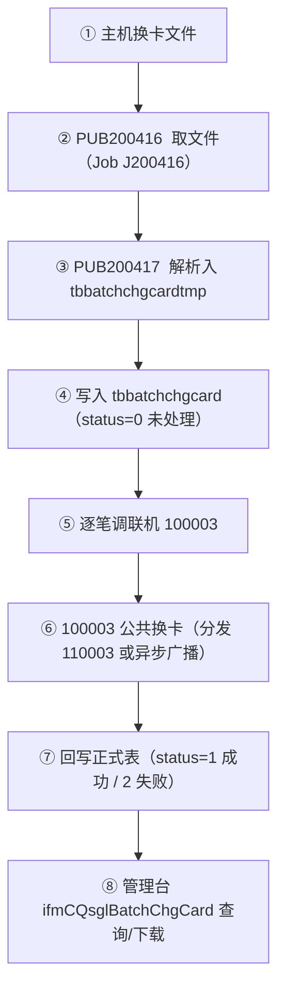
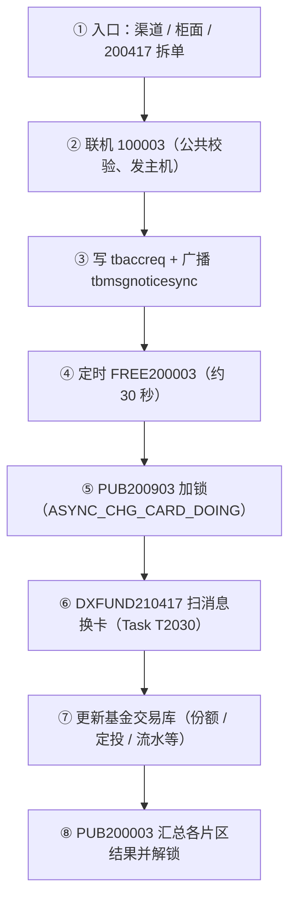
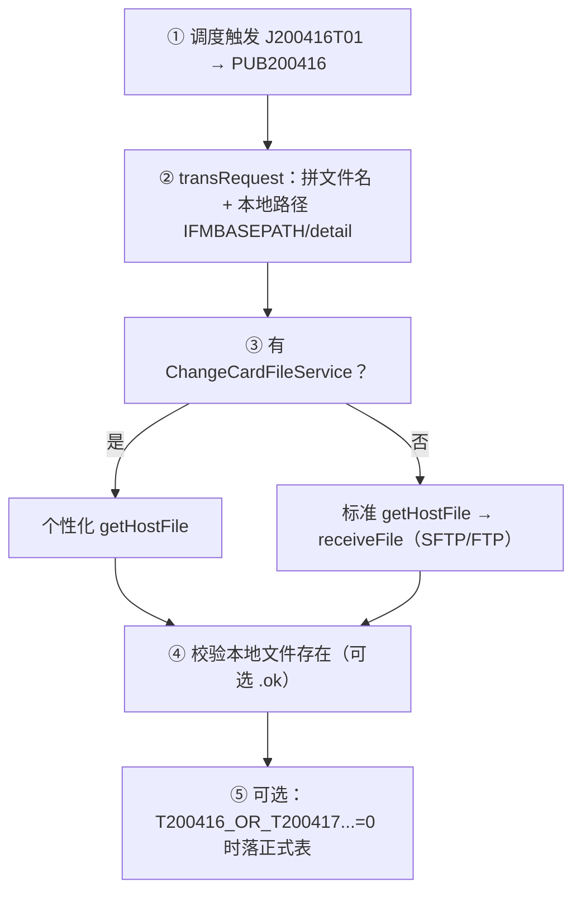

# 基金批量换卡开发文档

> 以基金代销（dxfund）为标准，基于 extradata `BatchChgCard` / `AsyncChgCard` 及源码梳理。  
> 适用范围：GIT-IFM6.0 综合理财管理平台；文档侧重标准配置、扩展参数、个性化开发落点。

---

## 一、功能概述

系统存在 **两条换卡链路**，职责不同、数据落点不同，常被统称为「批量换卡」：

| 链路 | extradata | 入口形态 | 核心交易码 | 结果落点 |
|------|-----------|----------|------------|----------|
| **文件批量换卡** | `BatchChgCard` | 日终调度取主机文件 | `PUB200416` → `PUB200417` → 拆单调联机 `100003` | `tbbatchchgcard` / `tbbatchchgcardtmp` |
| **联机异步换卡** | `AsyncChgCard` | 渠道/柜面/文件拆单触发联机 | `100003` → 定时 `FREE200003`（`200903` → 子系统 `210417` → `200003`） | `tbaccreq` + `tbmsgnoticesync` |

**基金标准结论：**

- 文件批量：公共片区 `200416/200417` 负责取文件、入库、拆单；真正改卡走公共联机 `100003`，再分发基金交易库联机 `110003`（或异步广播后由 `210417` 处理）。
- 联机异步：`100003` 写账户流水并按 `NOTICE_TYPE3` 广播；基金交易片区 `DXFUND210417` 扫 `tbmsgnoticesync` 更新份额/定投/流水等表；公共 `PUB200003` 汇总各片区结果并解锁。
- 管理台菜单 `ifmCQsglBatchChgCard` **仅查询/下载** `tbbatchchgcard`，不负责导入与提交。

#### 链路 A：文件批量换卡（BatchChgCard）



#### 链路 B：联机异步换卡（AsyncChgCard，基金标准）



两条链路通过 **`100003`** 交汇：文件批量在步骤⑤⑥拆单进入联机；若 `NOTICE_TYPE3` 含 `DXFUND_BATCH*`，则走链路 B 的异步消化，否则可同步分发基金联机 `110003`。

---

## 二、标准配置（extradata）

### 2.1 文件批量换卡 — `BatchChgCard.sql`

路径：`app/sql/sql-pub/pub/pub/extradata/BatchChgCard/BatchChgCard.sql`

| 配置项 | 值 | 说明 |
|--------|-----|------|
| 调度组 | `sche_group_code='04'` | 挂在日终组 |
| 父/子 Job | `J200416` → `J200417` | 取文件 → 执行换卡 |
| 父 Job 依赖 | `J200416` 的 `sche_parent_job_code='J200016'` | 按现场日终链调整 |
| Task | `J200416T01` / `J200417T01` | FunctionId：`PUB200416` / `PUB200417` |
| Registry（基线示例） | `lcpt-dxfund-pub-batch`，URL `/dxfund/pub/batch` | 须与实际承载 pub-batch 的子系统一致（理财现场则为 `lcpt-fina-pub-batch`） |

现场落地检查：

1. `tbschedulejob` / `tbscheduletask` / `tbscheduletaskregistry` 是否已下发且启用。
2. Registry 的 `app_name`、`app_url` 是否指向 **实际承载 pub-batch 的子系统**。
3. 参数 `PUB_BATCH_USE_SUBSYSTEM`（K_CPLX）与子系统部署一致（主要用于后续 417 拆单路由，416 取文件本身不依赖）。

#### 2.1.1 PUB200416（取批量换卡信息文件）成功执行所需配置

类：`T200416HSAdapter`（Bean：`TPUB200416HSAdapter`）  
职责：**从主机/文件服务器拉取换卡文件到本地**；默认**不**解析入库（入库在 417）。当参数 `T200416_OR_T200417_DEAL_TBBATCHCHGCARE=0` 时，416 会额外解析并写入 `tbbatchchgcardtmp` / `tbbatchchgcard`。



##### （1）调度与交易登记（必配）

| 配置 | 要求 | 来源 |
|------|------|------|
| `tbschedulejob` | `J200416` 启用，父节点按现场日终链挂好 | `BatchChgCard.sql` |
| `tbscheduletask` | `J200416T01`，`function_id='PUB200416'`，启用 | 同上 |
| `tbscheduletaskregistry` | `sche_task_code='J200416T01'`，`app_name`/`app_url` 指向实际 pub-batch 服务 | 同上（基金例：`lcpt-dxfund-pub-batch` + `/dxfund/pub/batch`） |
| `tbtrans` | `trans_code='200416'`，`enable_flag='1'`，`trans_type='4'` | `sql-pub/.../initdata/tbtrans.sql` |

```sql
-- tbtrans 基线示例
delete from tbtrans where trans_code = '200416';
INSERT INTO tbtrans (trans_code, trans_name, enable_flag, channels, host_online, trans_type, monitor_flag, log_level, cancel_flag, erase_flag, mon_trans_type, reserve1, reserve2, reserve3, prd_type)
VALUES ('200416', '取批量换卡信息文件', '1', '012134569G', '0', '4', '0', '2', '0', '0', '4', ' ', ' ', ' ', ' ');
```

Bean 须已部署在对应 pub-batch 包：`@Service("TPUB200416HSAdapter")`。

##### （2）应用配置（必配，标准取文件路径）

跑在 **pub-batch** 微服务的 `application.properties`（或配置中心等价项）：

| 配置项 | 含义 | 说明 |
|--------|------|------|
| `lcpt.config.IFMBASEPATH` | 本地基路径 | 落地目录为 `{IFMBASEPATH}/detail`，目录须存在且可写 |
| `lcpt.config.HOSTFILE.HostCheckPath` | 远端换卡文件目录 | **必填**；未配报「主机文件路径 ServerPath 未配置」；支持路径中含 `YYYYMMDD` |
| `lcpt.config.HOSTFILE.ServerIP` | 文件服务器 IP | **必填**（`FileTransferConfig` 校验） |
| `lcpt.config.HOSTFILE.Port` | 端口 | SFTP/FTP 端口 |
| `lcpt.config.HOSTFILE.UserID` / `Password` | 账号密码 | 按传输方式配置 |
| `lcpt.config.HOSTFILE.TransferWay` | 传输方式 | 如 `SFTP` / `FTP` |

基金 pub-batch 模板示例：

```properties
lcpt.config.IFMBASEPATH=/home/ifm60/dxfund/pub-area0
# HOSTFILE 取核心文件路径配置
lcpt.config.HOSTFILE.HostCheckPath=/path/to/host/chgcard/YYYYMMDD
lcpt.config.HOSTFILE.ServerIP=x.x.x.x
lcpt.config.HOSTFILE.Port=22
lcpt.config.HOSTFILE.UserID=xxx
lcpt.config.HOSTFILE.Password=xxx
lcpt.config.HOSTFILE.TransferWay=SFTP
```

可选文件名模板（SysConfig，非 tbparam）：

| 配置项 | 含义 |
|--------|------|
| `CARD_CHANGE_FILE` | 自定义文件名模板，可用 `YYYYMMDD` 占位；有值则覆盖默认 `cardinfo.{日期}` |

默认文件名规则（参数 `PLHK_USE_PHYDATE`）：

| `PLHK_USE_PHYDATE` | 文件名 |
|--------------------|--------|
| `0`（默认） | `cardinfo.{sysArg.initDate}` |
| `1` | `cardinfo.{物理日期}` |
| `2` | `cardinfo.{物理日期-1}` |
| `3` | `cardinfo.{sysArg.prevDate}` |

远端路径日期替换另受 `GET_FILE_PHYDATE` 控制（`0` 用 initDate，`1` 物理日，`2` 物理日-1）。

##### （3）系统参数 tbparam（与 416 直接相关）

| param_id | 必配/可选 | 默认 | 作用 |
|----------|-----------|------|------|
| `T200416_FILE` | 可选 | `HOSTFILE` | 指定读哪套 SysConfig 段（可改成银行自定义段名，须同步配好对应 `lcpt.config.{段名}.*`） |
| `PLHK_USE_PHYDATE` | 可选 | `0` | 本地/主机文件名日期取法，见上表 |
| `GET_FILE_PHYDATE` | 可选 | `0` | 远端 `HostCheckPath` 中 `YYYYMMDD` 替换用哪天 |
| `T200416_GETOKFILE` | 可选 | `0` | `1` 时同时取同名 `.ok`，且本地 `.ok` 必须存在 |
| `T200416_NOTWARN_WITHNOFILE` | 可选 | `0` | `1` 且文件名为空时直接成功返回（不报错） |
| `T200416_OR_T200417_DEAL_TBBATCHCHGCARE` | 可选 | `1` | `0`=416 内解析落正式表；`1`=仅取文件，解析留给 417 |
| `T200416_CHANGE_CARD_FILENAME` | 可选 | — | 从核心远程取到的文件名缓存（格式校验与 initDate 相关，见 `setHostFileName`） |

基线已插入示例：

```sql
delete from tbparam where param_id = 'T200416_FILE';
insert into tbparam (ta_code, param_id, param_name, param_value, value_name, belong_type, modi_flag, reserve1)
values ('000000', 'T200416_FILE', '200416读取换卡文件使用的配置名称', 'HOSTFILE', '不配此参数时，默认使用HOSTFILE配置的地址', '0', '1', ' ');
```

**仅当 `T200416_OR_T200417_DEAL_TBBATCHCHGCARE=0`（416 兼做入库）时还需要：**

| param_id | 说明 |
|----------|------|
| `FUND_200417FILESPLIT` | 有值则按 `\|@\|` 分割，否则 `\|` |
| `T200417_TARG_BANKACC_FIRST` | `1` 新卡在前 |
| `200417DELERROLDBKACC` | 是否删旧卡异常记录 |
| `FAIL_CHGCARD_REDO` | 是否重导历史失败记录 |
| `COMMIT_COUNT` | 批量提交笔数，默认 2000 |
| `IFMS_MUTI_BANK` | 多法人时按法人循环处理 |
| 表 | `tbbatchchgcard`、`tbbatchchgcardtmp`（及分表 `tbbankacc*`） |

默认 `=1` 时，416 **成功只需**：调度通 + HOSTFILE/IFMBASEPATH 通 + 远端文件能拉到本地（文件本身存在即可，不强制建换卡表）。

##### （4）个性化扩展（可选）

| Bean 名 | 接口 | 作用 |
|---------|------|------|
| `ChangeCardFileService` | `IChangeCardFileService` | 存在则走 `getHostFile` / `getHostFileName`，替代标准 SFTP 取文件 |
| `ChangeCardFileGetHostService` | `IChangeCardFileGetHostService` | 从核心远程解析真实文件名 |

有个性化 Bean 时，仍须保证其落地路径与后续 417 读取的 `{IFMBASEPATH}/detail/...` 一致（或由 `getLocalFileName` 对齐）。

##### （5）成功判定与联调检查清单

标准模式（仅取文件，`T200416_OR_T200417...` 默认 `1`）判定成功：

1. 调度能路由到 pub-batch 且加载 `TPUB200416HSAdapter`。
2. 本地目录 `{IFMBASEPATH}/detail` 可写。
3. `T200416_FILE` 指向的配置段（默认 `HOSTFILE`）IP/路径/账号齐全。
4. 远端存在当日规则对应的换卡文件（默认 `cardinfo.{日期}`，或 `CARD_CHANGE_FILE` 模板名）。
5. 传输完成后本地文件存在；若 `T200416_GETOKFILE=1`，同目录 `.ok` 也存在。
6. 批量日志出现「取批量换卡信息文件结束」。

常见失败：

| 现象 | 排查 |
|------|------|
| `ServerPath未配置` / `ServerIP未配置` | 补全 `lcpt.config.HOSTFILE.*` |
| `换卡文件不存在：.../detail/xxx` | 远端无文件、文件名日期规则不符、传输失败、本地路径错 |
| `换卡索引文件不存在：*.ok` | 开了 `T200416_GETOKFILE` 但无 ok 文件 |
| 调度找不到服务 | Registry `app_name`/`app_url` 与实际微服务不一致 |
| 有个性化 Bean 却仍走标准失败 | 检查 `ChangeCardFileService` 是否正确注册到该 pub-batch 进程 |

> 说明：416 **不调用** `100003`；只负责取文件（及可选入库）。真正换卡在 417 拆单之后。

### 2.2 联机异步换卡 — `AsyncChgCard`

路径：`app/sql/sql-pub/pub/pub/extradata/AsyncChgCard/`

| 文件 | 作用 |
|------|------|
| `AsyncChgCard.sql` | 公共骨架：Job `FREE200003`、Task `200903/200003`、trigger、菜单、公共参数 |
| `AsyncChgCard_dxfund.sql` | **基金标准**：挂载 `T2030` / `DXFUND210417` / `210417`，追加 `NOTICE_TYPE3` |
| `AsyncChgCard_dxasset.sql` | 资管：`T203B` / `2B0417` |
| `AsyncChgCard_dxtrust.sql` | 信托：`T2037` / `270417` |
| `AsyncChgCard_fina.sql` | 理财：`T2031` / `2H0941` + 分 TA 换卡参数 |
| `AsyncChgCard_struct.sql` | 结构性存款：`T203L` / `2L0417` |
| `AsyncChgCard_hstc.sql` | 投顾：`T2038` / `280941` |
| `AsyncChgCard.upd` | 部署检查清单（非可执行 SQL） |

#### 2.2.1 公共骨架（`AsyncChgCard.sql`）

| 配置项 | 值 | 说明 |
|--------|-----|------|
| Job | `FREE200003` 换卡最终结果更新 | 自由调度组 |
| Trigger | cron `0/30 * * * * ?` | 约 30 秒一轮 |
| Task 链头 | `FREE200003T00` → FunctionId `PUB200903` | 异步换卡开始/加锁 |
| Task 链尾 | `FREE200003T01` → FunctionId `PUB200003` | 汇总结果更新公共库 |
| tbtrans | `200003`、`200903` | 批量交易登记 |
| Registry | 按 pub 集成子系统选 `lcpt-dxfund-pub-batch` 或 `lcpt-fina-pub-batch` | 勿混用 |
| 管理台菜单 | `ifmCAsyncCardRepExceHand` | 异步换卡异常处理（查询/重发） |

公共参数（脚本内）：

| param_id | 含义 | 默认/说明 |
|----------|------|-----------|
| `ASYNC_CHG_CARD_DOING` | 是否校验异步换卡正在处理中 | `0` |
| `NOTICE_TYPE3` | 换卡需要校验/订阅的服务列表 | 逗号分隔，子系统脚本追加 |
| `T100003_QUERY_DATABASE` | 理财换卡明细报表查询库（0 公共 / 1 交易） | belong_type=2 |

#### 2.2.2 基金挂载（`AsyncChgCard_dxfund.sql`）— 标准

| 配置项 | 值 |
|--------|-----|
| sche_task_code | `T2030` |
| sche_parent_task_code | `FREE200003T00` |
| FunctionId | `DXFUND210417` |
| tbtrans | `210417` 基金异步换卡，`prd_type='0'` |
| Registry | `lcpt-dxfund-batch-trans1/2`，URL `/dxfund/trans/batch` |
| 依赖回写 | 将 `FREE200003T01` 的 parent 追加 `,T2030` |
| NOTICE_TYPE3 | 追加 `DXFUND_BATCH1,DXFUND_BATCH2` |

基金现场执行顺序建议：

1. 执行 `AsyncChgCard.sql` 第 1 段（Job/Task/Trigger/tbtrans/参数）。
2. 按 pub 挂在基金，执行 Registry 指向 `lcpt-dxfund-pub-batch` 的段落。
3. 执行 `AsyncChgCard_dxfund.sql`。
4. 若还有资管/信托/理财等同库部署，再执行对应子系统脚本（均向 `FREE200003` 挂子 Task，并向 `NOTICE_TYPE3` 追加订阅名）。

### 2.3 管理台菜单（查询侧）

| 项 | 内容 |
|----|------|
| 菜单码 | `ifmCQsglBatchChgCard`（批量换卡查询） |
| kind_code | `console-account-vue` |
| 父菜单 | `accountQuery` |
| tree_idx | `/console-account-vue/accountQuery/ifmCQsglBatchChgCard/` |
| 子交易 | Query / Down / CoC（编排列）/ QrC（编排条件） |
| 后端 | `BatchChgCardController` → `BatchChgCardService` |
| 接口 | `/ifmCQsglBatchChgCard/ifmCQsglBatchChgCardQuery`、`...Down` |
| 异步异常菜单 | `ifmCAsyncCardRepExceHand`（`console-bizframe-vue`） |
| 异常接口 | `/ifmCAsyncCardRepExceHand/ifmCAsyncCardRepExceHandQuery`、`...Retrans` |

脚本来源：

| 内容 | 路径 |
|------|------|
| 批量换卡查询菜单/交易/子交易/编排条件 | `app/sql/sql-pub/pub/pub/base/initdata/bizframe_init_data.sql` |
| 编排列/编排条件子交易 | `app/sql/sql-pub/pub/pub/extradata/menuDesign/menuDesign.sql` |
| 异步换卡异常处理菜单 | `app/sql/sql-pub/pub/pub/extradata/AsyncChgCard/AsyncChgCard.sql` |

前端多为 `console-account-vue` / `console-bizframe-vue` 编排渲染，Sources 内通常无独立 Vue 源文件。现场增量下发请写入 `spsql/`，勿改基线 `sql/`。

#### 2.3.1 批量换卡查询 — `ifmCQsglBatchChgCard`

```sql
-- 菜单 / 交易 / 子交易（基线：bizframe_init_data.sql）
delete from tsys_menu where menu_code = 'ifmCQsglBatchChgCard';
INSERT INTO tsys_menu (menu_code, kind_code, trans_code, sub_trans_code, menu_name, menu_arg, menu_icon, window_type, tip, hot_key, parent_code, order_no, open_flag, tree_idx, remark, window_model)
VALUES ('ifmCQsglBatchChgCard', 'console-account-vue', 'ifmCQsglBatchChgCard', 'ifmCQsglBatchChgCardQuery', '批量换卡查询', NULL, 'images/ifm/qsgl/batchChgCard.gif', NULL, NULL, NULL, 'accountQuery', '6', NULL, '/console-account-vue/accountQuery/ifmCQsglBatchChgCard/', ' ', ' ');

delete from tsys_trans where trans_code = 'ifmCQsglBatchChgCard';
INSERT INTO tsys_trans (trans_code, trans_name, kind_code, model_code, remark, ext_field_1, ext_field_2, ext_field_3)
VALUES ('ifmCQsglBatchChgCard', '批量换卡查询', 'ifmmanage', '7', '交易', NULL, NULL, NULL);

delete from tsys_subtrans where trans_code = 'ifmCQsglBatchChgCard';
INSERT INTO tsys_subtrans (trans_code, sub_trans_code, sub_trans_name, rel_serv, rel_url, ctrl_flag, login_flag, remark, ext_field_1, ext_field_2, ext_field_3)
VALUES ('ifmCQsglBatchChgCard', 'ifmCQsglBatchChgCardQuery', '批量换卡查询', 'ifm.pub.query.batchchgcard.BatchChgCard', 'ifm/pub/query/batchchgcard/batchChgCard.mw', '0', '1', '子交易', '00', ' ', ' ');
INSERT INTO tsys_subtrans (trans_code, sub_trans_code, sub_trans_name, rel_serv, rel_url, ctrl_flag, login_flag, remark, ext_field_1, ext_field_2, ext_field_3)
VALUES ('ifmCQsglBatchChgCard', 'ifmCQsglBatchChgCardDown', '批量换卡文件下载', 'ifm.pub.query.batchchgcard.BatchChgCardDown', NULL, '0', '1', '子交易', '00', ' ', ' ');

-- 页面编排子交易（menuDesign.sql）
delete from tsys_subtrans where trans_code = 'ifmCQsglBatchChgCard' and sub_trans_code = 'ifmCQsglBatchChgCardCoC';
insert into tsys_subtrans(trans_code,sub_trans_code,sub_trans_name,rel_serv,rel_url,ctrl_flag,login_flag,remark,ext_field_1,ext_field_2,ext_field_3)
values ('ifmCQsglBatchChgCard', 'ifmCQsglBatchChgCardCoC', '批量换卡用户编排列查询', 'ifm.pub.query.batchchgcard.BatchChgCard', 'ifm/pub/query/batchchgcard/batchChgCard.mw', '0', '1', '子交易', '00', ' ', ' ');
delete from tsys_subtrans where trans_code = 'ifmCQsglBatchChgCard' and sub_trans_code = 'ifmCQsglBatchChgCardQrC';
insert into tsys_subtrans(trans_code,sub_trans_code,sub_trans_name,rel_serv,rel_url,ctrl_flag,login_flag,remark,ext_field_1,ext_field_2,ext_field_3)
values ('ifmCQsglBatchChgCard', 'ifmCQsglBatchChgCardQrC', '批量换卡用户编排条件查询', 'ifm.pub.query.batchchgcard.BatchChgCard', 'ifm/pub/query/batchchgcard/batchChgCard.mw', '0', '1', '子交易', '00', ' ', ' ');

-- 查询条件 / 结果列编排（tbmenucondition，基线）
-- condition_kind='0' 查询条件；condition_kind='1' 结果列
delete from tbmenucondition where menu_code = 'ifmCQsglBatchChgCard';
insert into tbmenucondition(menu_code, component_kind, condition_kind, element_code, element_name, data_dict, check_format, default_value, required_flag, readonly_flag, visable, data_width, order_no, exp_flag, sort_no, sort_flag) VALUES ('ifmCQsglBatchChgCard', 'L', '0', 'transDate', '导入日期', ' ', ' ', ' ', ' ', ' ', '1', 120, 1, '1', '0', ' ');
insert into tbmenucondition(menu_code, component_kind, condition_kind, element_code, element_name, data_dict, check_format, default_value, required_flag, readonly_flag, visable, data_width, order_no, exp_flag, sort_no, sort_flag) VALUES ('ifmCQsglBatchChgCard', '1', '0', 'bankAcc', '旧卡卡号', ' ', ' ', ' ', ' ', ' ', '1', 120, 2, '1', '0', ' ');
insert into tbmenucondition(menu_code, component_kind, condition_kind, element_code, element_name, data_dict, check_format, default_value, required_flag, readonly_flag, visable, data_width, order_no, exp_flag, sort_no, sort_flag) VALUES ('ifmCQsglBatchChgCard', '1', '0', 'targBankAcc', '新卡卡号', ' ', ' ', ' ', ' ', ' ', '1', 120, 3, '1', '0', ' ');
insert into tbmenucondition(menu_code, component_kind, condition_kind, element_code, element_name, data_dict, check_format, default_value, required_flag, readonly_flag, visable, data_width, order_no, exp_flag, sort_no, sort_flag) VALUES ('ifmCQsglBatchChgCard', 'A', '0', 'status', '处理状态', 'K_CLZT', ' ', ' ', ' ', ' ', '1', 120, 4, '1', '0', ' ');
insert into tbmenucondition(menu_code, component_kind, condition_kind, element_code, element_name, data_dict, check_format, default_value, required_flag, readonly_flag, visable, data_width, order_no, exp_flag, sort_no, sort_flag) VALUES ('ifmCQsglBatchChgCard', '1', '1', 'transDateName', '导入日期', ' ', ' ', ' ', ' ', ' ', '1', 120, 1, '1', '0', ' ');
insert into tbmenucondition(menu_code, component_kind, condition_kind, element_code, element_name, data_dict, check_format, default_value, required_flag, readonly_flag, visable, data_width, order_no, exp_flag, sort_no, sort_flag) VALUES ('ifmCQsglBatchChgCard', '1', '1', 'bankAcc', '旧卡卡号', ' ', ' ', ' ', ' ', ' ', '1', 200, 2, '1', '0', ' ');
insert into tbmenucondition(menu_code, component_kind, condition_kind, element_code, element_name, data_dict, check_format, default_value, required_flag, readonly_flag, visable, data_width, order_no, exp_flag, sort_no, sort_flag) VALUES ('ifmCQsglBatchChgCard', '1', '1', 'targBankAcc', '新卡卡号', ' ', ' ', ' ', ' ', ' ', '1', 200, 3, '1', '0', ' ');
insert into tbmenucondition(menu_code, component_kind, condition_kind, element_code, element_name, data_dict, check_format, default_value, required_flag, readonly_flag, visable, data_width, order_no, exp_flag, sort_no, sort_flag) VALUES ('ifmCQsglBatchChgCard', '1', '1', 'cfmDateName', '处理日期', ' ', ' ', ' ', ' ', ' ', '1', 120, 4, '1', '0', ' ');
insert into tbmenucondition(menu_code, component_kind, condition_kind, element_code, element_name, data_dict, check_format, default_value, required_flag, readonly_flag, visable, data_width, order_no, exp_flag, sort_no, sort_flag) VALUES ('ifmCQsglBatchChgCard', '1', '1', 'status', '处理状态', ' ', ' ', ' ', ' ', ' ', '1', 120, 5, '1', '0', ' ');
insert into tbmenucondition(menu_code, component_kind, condition_kind, element_code, element_name, data_dict, check_format, default_value, required_flag, readonly_flag, visable, data_width, order_no, exp_flag, sort_no, sort_flag) VALUES ('ifmCQsglBatchChgCard', '1', '1', 'errCode', '返回码', ' ', ' ', ' ', ' ', ' ', '1', 120, 6, '1', '0', ' ');
insert into tbmenucondition(menu_code, component_kind, condition_kind, element_code, element_name, data_dict, check_format, default_value, required_flag, readonly_flag, visable, data_width, order_no, exp_flag, sort_no, sort_flag) VALUES ('ifmCQsglBatchChgCard', '1', '1', 'errMsg', '返回信息', ' ', ' ', ' ', ' ', ' ', '1', 200, 7, '1', '0', ' ');
```

子交易对照：

| sub_trans_code | 名称 | rel_serv |
|----------------|------|----------|
| `ifmCQsglBatchChgCardQuery` | 查询 | `ifm.pub.query.batchchgcard.BatchChgCard` |
| `ifmCQsglBatchChgCardDown` | 下载 | `ifm.pub.query.batchchgcard.BatchChgCardDown` |
| `ifmCQsglBatchChgCardCoC` | 编排列 | 同 Query |
| `ifmCQsglBatchChgCardQrC` | 编排条件 | 同 Query |

#### 2.3.2 异步换卡异常处理 — `ifmCAsyncCardRepExceHand`

```sql
-- 来源：AsyncChgCard.sql（gaocc M202205270620）
delete from tsys_menu where menu_code ='ifmCAsyncCardRepExceHand';
INSERT INTO tsys_menu(menu_code, kind_code, trans_code, sub_trans_code, menu_name, menu_arg, menu_icon, window_type, tip, hot_key, parent_code, order_no, open_flag, tree_idx, remark, window_model)
VALUES ('ifmCAsyncCardRepExceHand', 'console-bizframe-vue', 'ifmCAsyncCardRepExceHand', 'ifmCAsyncCardRepExceHandQuery', '异步换卡异常处理', NULL, 'images/ifm/xtgl/refresh.gif', '0', NULL, NULL, 'bizOtherManager', 5, NULL, '/console-bizframe-vue/bizPubManager/bizOtherManager/ifmCAsyncCardRepExceHand/', NULL, ' ');

delete from tsys_trans where trans_code ='ifmCAsyncCardRepExceHand';
INSERT INTO tsys_trans(trans_code, trans_name, kind_code, model_code, remark, ext_field_1, ext_field_2, ext_field_3)
VALUES ('ifmCAsyncCardRepExceHand', '异步换卡异常处理', 'ifmmanage', '9', ' ', ' ', ' ', ' ');

delete from tsys_subtrans where sub_trans_code ='ifmCAsyncCardRepExceHandQuery';
INSERT INTO tsys_subtrans(trans_code, sub_trans_code, sub_trans_name, rel_serv, rel_url, ctrl_flag, login_flag, remark, ext_field_1, ext_field_2, ext_field_3)
VALUES ('ifmCAsyncCardRepExceHand', 'ifmCAsyncCardRepExceHandQuery', '异步换卡异常处理查询', 'ifm.pub.parameter.refresh.RefreshSetQuery', ' ', '0', '1', ' ', '00', ' ', ' ');

delete from tsys_subtrans where sub_trans_code ='ifmCAsyncCardRepExceHandRetrans';
INSERT INTO tsys_subtrans(trans_code, sub_trans_code, sub_trans_name, rel_serv, rel_url, ctrl_flag, login_flag, remark, ext_field_1, ext_field_2, ext_field_3)
VALUES ('ifmCAsyncCardRepExceHand', 'ifmCAsyncCardRepExceHandRetrans', '异步换卡异常处理重发', 'ifm.pub.parameter.refresh.RefreshSetQuery', ' ', '0', '1', ' ', '00', ' ', ' ');
```

| 项 | 内容 |
|----|------|
| 父菜单 | `bizOtherManager` |
| kind_code | `console-bizframe-vue` |
| 子交易 | Query / Retrans（重发） |
| 后端 | `CAsyncCardRepExceController` → `CAsyncCardRepExceServiceImpl` |

### 2.4 `AsyncChgCard.upd` 部署检查项

1. 低柜 `ares-app-config.xml`：`100003` 指向 pub-online（可与 `100001` 同服务）。
2. 各微服务配置 `lcpt.pub.api.appname` 与入口子系统一致（基金入口则 `lcpt-dxfund-pub-api`）。
3. `tbtrans` 中 `100003` 的 `trans_type` 按现场改为 `1`（理财脚本亦有此更新）。
4. 核对 `BIZ_TYPE`、`K_CPLX`、`tbareainfo` 仅保留现场子系统，删除多余。

---

## 三、核心代码落点（基金标准）

### 3.1 文件批量换卡

| 交易码 | Bean | 模块路径 | 职责 |
|--------|------|----------|------|
| 200416 | `TPUB200416HSAdapter` | `lcpt-pub-batch-adapter/.../T200416/` | 取主机换卡文件；可选在本节点落正式表 |
| 200417 | `TPUB200417HSAdapter` | `lcpt-pub-batch-adapter/.../T200417/` | 解析文件→tmp→正式表；循环发 `100003`；回写 status |
| — | `AutoChgCardProcessor` | 同 T200417 包 | 自动换卡处理辅助 |
| — | `IChangeCardFileService` | `lcpt-pub-core/.../interfaces/` | **个性化扩展接口**（取文件/解析/本地文件名等） |

`T200416` 标准流程要点：

1. 优先查找 Spring Bean 名 `ChangeCardFileService`；存在则调用 `getHostFile`，否则标准 `getHostFile`（SFTP/FTP，配置段由 `T200416_FILE` 指定，默认 `HOSTFILE`）。
2. 参数 `T200416_OR_T200417_DEAL_TBBATCHCHGCARE`：`0` 表示在 416 即处理正式表，默认 `1` 表示在 417 处理。
3. **成功执行所需配置清单**见 **§2.1.1**（调度、`tbtrans`、`IFMBASEPATH`/`HOSTFILE`、相关 tbparam、联调检查项）。

`T200417` 标准流程要点：

1. `loadChgCardInfoFile`：有个性化则走 `ChangeCardFileService.loadChgCardInfoFile`，否则按 `|` 或 `|@|` 解析写入 `tbbatchchgcardtmp`。
2. 校验旧卡存在性/状态、删除异常旧卡记录（参数控制）后插入 `tbbatchchgcard`（status=`0`）。
3. `batchChgCard`：对未处理记录组装 `100003` 请求（`pack100003Dataset`），经 `OnlineServiceClient` 调用，回写 `cfm_date/status/err_*`。

### 3.2 联机换卡与基金异步

| 交易码 | Bean | 模块路径 | 职责 |
|--------|------|----------|------|
| 100003 | `T100003HSAdapter` | `lcpt-pub-online-adapter/.../T100003/` | 公共联机换卡：校验、发主机、分发子系统、写异步消息 |
| 110003 | `T110003HSAdapter` | `lcpt-dxfund-online-trade-.../T110003/` | 基金交易库联机换卡落地 |
| 200903 | `TPUB200903HSAdapter` | `lcpt-pub-batch-adapter/.../T200903/` | 异步换卡开始：校验 TA 非清算、置处理中锁 |
| 210417 | `TDXFUND210417HSAdapter` | `lcpt-dxfund-batch-.../T210417/` | 扫消息广播表，并发处理基金异步换卡 |
| 200003 | `TPUB200003HSAdapter` | `lcpt-pub-batch-adapter/.../T200003/` | 汇总各片区 `tbmsgnoticesync`，更新公共卡并解锁 |

`T210417` 要点（与 200417 **不同**，注释已标明）：

- 用于 **联机异步换卡**，扫描消息广播表，不做文件导入。
- TA 处于清算中则直接 return。
- `PubApiFactory.getMsgNoticeSyncInfoList(基金, 交易片区, 客户换卡, 当前片区, 处理中)`。
- 并发上限参数 `ASY_CHG_THREAD_NUM_MAX`（默认 5），任务类 `T210417Task`。

### 3.3 管理台

| 类 | 路径 | 职责 |
|----|------|------|
| `BatchChgCardController` | `lcpt-web-manager-pub-core/.../ifmCQsglQuery/` | Query / Down |
| `BatchChgCardService` | 同模块 service | 查 `tbbatchchgcard`、导出 |
| `BatchChgCardDto` / `IBatchChgCardService` | dto / interfaces | 入参与接口 |
| 异步异常 | `CAsyncCardRepExceController` + ServiceImpl | 查询/重发 |

### 3.4 领域对象

| 类 | 说明 |
|----|------|
| `BatchChgCard` / `BatchChgCardDesc` | 公共域 bean / 表描述 |
| `DxFundBatchChgCard` + Dao | 基金侧对称实体（若使用） |
| 资管/信托同名 `DxAsset*` / `DxTrust*` | 子系统扩展 |

---

## 四、数据表

### 4.1 `tbbatchchgcard`（批量换卡正式表）

基线 DDL（mysql）：`sql-pub/.../000schema/mysql/001dbstruct_account_mysql.table.sql`

| 字段 | 说明 |
|------|------|
| trans_date | 交易日期（主键） |
| bank_acc | 旧卡号（主键） |
| targ_bank_acc | 新卡号 |
| cfm_date | 确认日期 |
| status | K_CLZT：`0` 未处理 / `Z` 处理中 / `1` 成功 / `2` 失败 |
| err_code / err_msg | 错误信息 |
| reserve1 | 保留；部分增量主键含此字段（换卡顺序等） |
| in_client_no | 内部客户号 |
| open_branch | 所属机构 |
| bank_no | 法人/租户 |

说明：增量脚本可能增加 `channel`、调整主键为 `(trans_date, bank_acc, reserve1)`，以现场 spsql 为准。

### 4.2 `tbbatchchgcardtmp`（导入临时表）

主键 `(bank_acc, targ_bank_acc)`；导入完成后清理。字段含 `reserve1`（顺序）、`in_client_no`、`err_code/err_msg` 等。

### 4.3 异步相关（无独立 `tbasyncchgcard` 表）

| 表 | 用途 |
|----|------|
| `tbaccreq` | `trans_code='100003'` 账户类流水 |
| `tbmsgnoticesync` | 各片区异步处理状态（成功/失败/处理中） |

银行个性化可能存在分表，如南京 `tbbatchchgcardnjyh{n}`。

---

## 五、扩展参数清单

以下参数为批量/异步换卡开发与联调时的主要扩展点。取值以现场 `tbparam` 为准；常量定义见 `IParamConstant` / `IConstant` / `IPubParamConstant`。

### 5.1 文件取数与命名（200416）

| 参数 ID | 含义 | 常用默认 |
|---------|------|----------|
| `T200416_FILE` / Host 配置名 | 读文件配置（如 HOSTFILE） | 配置中心 |
| `T200416_CHANGE_CARD_FILENAME` | 从主机获取的换卡文件名 | — |
| `PLHK_USE_PHYDATE` | 文件是否按物理日期命名/取数 | `0` |
| `T200416_GETOKFILE` | 是否同时取 `.ok` 文件 | `0` |
| `T200416_NOTWARN_WITHNOFILE` | 无文件是否不告警 | `0` |
| `T200416_OR_T200417_DEAL_TBBATCHCHGCARE` | `0`=416 落正式表，`1`=417 落正式表 | `1` |
| `EXTRA_TRADE_FILE_DATES` | 额外补读历史日期文件 | — |

### 5.2 文件解析与入库（200417）

| 参数 ID | 含义 | 常用默认 |
|---------|------|----------|
| `FUND_200417FILESPLIT` | 分隔符标志；有值则用 `\|@\|`，否则 `\|` | 空 |
| `T200417_TARG_BANKACC_FIRST` | 新卡是否在文件第一列 | `0` |
| `200417DELERROLDBKACC`（常量 `T200417DELERROLDBANKACC`） | 是否删除临时表中旧卡异常数据 | `1` |
| `T200417_CHECK_OLDBANKACCSTATUS` | 是否校验旧卡状态须正常 | `0` |
| `T200417_RECORD_BANK_ACC_NOT_EXIST` | 旧卡不存在时是否仍保留记录 | `0` |
| `BATCHCHGCARD_INSERT_NEWCARD_OPENBRANCH` | 插入时是否带新卡开户机构 | `0` |
| `BatchChgShowWarnMsg` | 导入告警展示控制 | `0` |
| `COMMIT_COUNT` | 批量提交笔数 | `2000` |
| `PUB_BATCH_USE_SUBSYSTEM` | 公共批量换卡挂哪个子系统（K_CPLX） | — |

### 5.3 拆单调 100003 行为

| 参数 ID | 含义 | 常用默认 |
|---------|------|----------|
| `BATCHCHGNOHOST` | 拆单笔是否发主机（`0` 发 / `1` 不发，以实现为准） | `0` |
| `T200417_CHG_CARD_NOT_TOHOST` | 批量换卡不发核心 | `0` |
| `T200417_SKIP_ONWAY_CHECK` | 跳过在途校验 | `0` |
| `CHANGINGCARDOLDCARDNOTRANS2` | 换卡中旧卡交易限制相关 | — |
| `BATCH_OPER` / `BATCH_BRANCH` | 批量柜员、机构 | 必配 |
| `ADD_GLOBAL_SERIALNO` | 是否增加全局流水号 | `0` |

### 5.4 联机换卡 100003 / 业务控制

| 参数 ID | 含义 |
|---------|------|
| `NOTICE_TYPE3` | 异步换卡订阅服务列表；基金标准含 `DXFUND_BATCH1,DXFUND_BATCH2` |
| `ASYNC_CHG_CARD_DOING` | 是否校验/锁定异步换卡进行中 |
| `ASYNC_CHG_CARD_HALF_FLAG` | 半成功（如新卡不存在报错）停批/告警策略 |
| `ASY_CHG_THREAD_NUM_MAX` | 210417 并发线程上限，默认 `5` |
| `CHGCARGFLAG` | 有在途是否允许换卡 |
| `CHGCARD_MERGESHARE` | 换卡是否份额合并 |
| `CHANGINGCARDOLDCARDNOTRANS` | 换卡中是否不允许发起交易 |
| `BATCH_CHG_CARD_USE_SELF_BANK_NO` | 管理台多法人是否用表自身 bank_no |
| `T100003_NO_SEND_HOST_CHANNEL` | 换卡不发核心的渠道 |
| `T100003_KEEP_OLD_BANK_ACC` | 是否保留旧卡 |
| `T100003_USE_OLD_OPENBRANCH` | 是否使用旧卡开户机构 |
| `T100003_ASYN_SUPORT_PRDTYPES` | 异步支持的产品类型 |
| `T100003_ASYN_SKIP_TYPE` | 异步跳过类型 |
| `T100003_CHECK_OPEN_TA_STATUS` / `T100003_TASTATUS_CHK_FLAG` | 是否校验 TA 状态（含银行个性化） |
| `T100003_ERR_ADD_ACCREQ` | 报错是否记流水 |
| `T100003_SUCC_ERRORNO` / `T100003_NOSUPPORTTA_ERR` | 视作成功的错误码集合 |
| `T100002_CHECK_ONWAY_ASYNC_CHGCARD` | 解约等是否校验在途异步换卡 |

### 5.5 基金 / 理财子系统补充

| 参数 ID | 归属 | 含义 |
|---------|------|------|
| `DXFUND_CHGCARD_CHG_HISREPEAL` 等 | dxfund | 换卡是否改冲正/历史相关表 |
| `STARDAND_PUB_CHANGE_CARD` | fina | 是否采用标准换卡 |
| `FINA_CHANGE_CARD_BY_TA` | fina 分 TA | `0` 实时 1H0224 / `1` 异步 100224 / `2` 实时 1H0003 / `3` 异步 058 / `4` 不支持 / `5` 线下强增强减 |
| `CHANGE_CHK_NEW_BANK_FLAG` | 理财/投顾等 | 联机购买是否校验卡正在换卡 |
| `CHANGCARD_CHK_OPENING_058` | 公共/理财 | 换卡是否校验正在开户 |

---

## 六、个性化开发点

### 6.1 首选扩展：实现 `IChangeCardFileService`

接口：`com.hundsun.lcpt.pub.services.interfaces.IChangeCardFileService`  
Spring Bean 名必须为：**`ChangeCardFileService`**

| 方法 | 何时覆盖 | 说明 |
|------|----------|------|
| `getHostFile` | 取文件路径/协议/ECIF/OSS 与标准不同 | 416 优先调用 |
| `getHostFileName` | 文件名规则个性化（含物理日只执行一次等） | default 原样返回 |
| `getLocalFileName` | 落地本地名、核心回传路径上送 OSS | 417 使用 |
| `loadChgCardInfoFile` | 文件编码、列序、分隔符、过滤规则非标准 | 完全替代标准解析 |
| `batchChgCard` | 拆单/处理逻辑整体个性化 | 少见，慎用 |

已有银行实现示例（不完全列表）：

- pub-batch：`qingdyh`、`dgyh`、`hbyh`、`gzyh`、`jxyh`、`shnsh`、`sznsh`、`xayh`、`ccnsh`、`czyh`、`whnsh`、`yongfyh`、`jiangxyh`、`njyh_fina`、`tjyh_fina`、`gzyhinsuremetal` 等  
- pub-core：`ybsh`、`mtsh`  
- dxasset-pub-batch：`qingdyh_dxasset`、`tjyh_dxasset` 等  

**开发步骤建议：**

1. 在 `.../pub/batch/bank/{银行代码}/impl/` 新建 `ChangeCardFileServiceImpl`（或同名 `ChangeCardFileService`）。
2. 实现接口；仅覆盖需要的方法，其余走 default。
3. 用 `.upd` / Spring 配置注册 Bean 名 `ChangeCardFileService`（个性化工程惯例）。
4. 用参数控制能解决的（列序、分隔符、物理日、是否发核心）**优先参数**，避免复制整份 417。

### 6.2 覆盖 / 旁路 HSAdapter

适用场景：流程与标准差异过大（分表、独立交易码、保险贵金属等）。

| 模式 | 示例 |
|------|------|
| 同码个性化包 | `gzyhinsuremetal/T200417/T200417HSAdapter` |
| 独立交易码 | 上海农商/青岛等 `T209003`、`T209416`、`T209417`；南京 `T219009` + 分表 |
| MQ 个性化 | 宁波等 `ChgCardMqService` / `NbyhChgCardMqService` |

注意：旁路 Adapter 需同步配置 `tbtrans`、调度 FunctionId、低柜/网关路由，避免与标准节点双跑。

### 6.3 调度与 Registry 个性化

- 调整 `sche_group_code`、父节点、是否启用、cron。
- Registry 的 `app_name` 必须与现场微服务名一致（含 trans1/trans2 多实例）。
- 多子系统同库时，所有子 Task 挂在 `FREE200003` 下，`FREE200003T01` 的 `sche_parent_task_code` 需包含全部子系统 Task（脚本用 `concat` 追加）。

### 6.4 管理台 / 异常处理个性化

- 查询条件、多法人 `bank_no`：参数 `BATCH_CHG_CARD_USE_SELF_BANK_NO` + Service SQL。
- 异步失败重发：菜单 `ifmCAsyncCardRepExceHand` + `CAsyncCardRepExceServiceImpl`；银行若要改重发策略在此扩展。
- 菜单/权限 spsql 下发至对应银行版本目录（勿改基线 `sql/`）。

### 6.5 基金交易侧扩展点

- 联机落地：`T110003HSAdapter`（份额、定投、流水、历史确认等表更新）。
- 异步落地：`T210417HSAdapter` / `T210417Task`（含并发、TA 清算跳过）。
- 在途拦截：公共/基金交易前校验（如 `DxFundTransPubStrDealService`）在 `NOTICE_TYPE3` 含 DXFUND 时禁止该卡新交易。
- 基金 tbparam：冲正表、历史表是否随换卡更新等。

### 6.6 个性化开发检查清单

1. 确认走 **文件批量**、**联机异步** 或两者都要。  
2. 确认数据库类型与现有 spsql 银行目录。  
3. 优先参数配置；不够再实现 `ChangeCardFileService`；仍不够再旁路 Adapter。  
4. 下发：`BatchChgCard.sql` + `AsyncChgCard.sql` + `AsyncChgCard_dxfund.sql`（及同库其他子系统脚本）。  
5. 修正 Registry 服务名；配置 `NOTICE_TYPE3`、`lcpt.pub.api.appname`、低柜 `100003` 路由。  
6. 联调：无文件告警、旧卡不存在、在途、TA 清算中、半成功、多法人、管理台查询下载、异常重发。

---

## 七、子系统对照（简要）

| 维度 | 基金 dxfund（标准） | 资管 | 信托 | 理财 | 结构存款 / 投顾 |
|------|-------------------|------|------|------|-----------------|
| 异步 Task | T2030 | T203B | T2037 | T2031 | T203L / T2038 |
| FunctionId | DXFUND210417 | DXASSET2B0417 | DXTRUST270417 | FINA2H0941 | STRUCT2L0417 / PUB280941 |
| 交易码 | 210417 | 2B0417 | 270417 | 2H0941 | 2L0417 / 280941 |
| NOTICE_TYPE3 | DXFUND_BATCH* | DXASSET_BATCH* | DXTRUST_BATCH* | FINA_API 等 | STRUCT_BATCH* / 投顾配置 |
| 联机换卡 | 110003 | 1B0003 等 | 信托联机换卡 | 分 TA 模式更复杂 | — |
| 文件批量 | 共用 pub 200416/417 | 同左 | 同左 | 常挂 fina-pub-batch | 同左 |

新子系统接入异步换卡：参照 `AsyncChgCard_dxfund.sql` 增加 Task + Registry + tbtrans + 追加 `NOTICE_TYPE3` + 实现扫消息 Adapter。

---

## 八、基金端到端流程（联调视角）

### 8.1 文件批量

1. **取文件**：日终跑 `J200416` → `PUB200416`；个性化则 `ChangeCardFileService.getHostFile`。  
2. **导入校验**：`PUB200417` 解析入 `tbbatchchgcardtmp`，校验旧卡/状态后写入 `tbbatchchgcard`(status=0)。  
3. **拆单处理**：逐笔组 `100003`；按参数决定是否发核心、是否跳过在途。  
4. **结果**：回写 status=1/2；管理台 `ifmCQsglBatchChgCard` 查询下载。  
5. **子系统落地**：若 `100003` 同步分发则走 `110003`；若走异步广播则由 `FREE200003` 链路上的 `210417` 消化。

### 8.2 联机异步

1. 渠道/柜面/文件拆单调用 `100003`。  
2. 写 `tbaccreq`，按 `NOTICE_TYPE3` 广播 `tbmsgnoticesync`。  
3. `FREE200003`：`200903` 加锁 → `210417` 并发换卡 → `200003` 各片区全成功才改公共卡并解锁。  
4. 失败/半成功：管理台异常处理重发；关注 `ASYNC_CHG_CARD_HALF_FLAG`。

---

## 九、关键源码与脚本索引

```
# extradata
app/sql/sql-pub/pub/pub/extradata/BatchChgCard/BatchChgCard.sql
app/sql/sql-pub/pub/pub/extradata/AsyncChgCard/AsyncChgCard*.sql|.upd

# 批量
.../lcpt-pub-batch-adapter/.../T200416/T200416HSAdapter.java
.../lcpt-pub-batch-adapter/.../T200417/T200417HSAdapter.java
.../lcpt-pub-batch-adapter/.../T200903/   # 异步开始
.../lcpt-pub-batch-adapter/.../T200003/   # 结果汇总
.../lcpt-dxfund-batch-bootstrap-adapter/.../T210417/T210417HSAdapter.java

# 联机
.../lcpt-pub-online-adapter/.../T100003/
.../lcpt-dxfund-online-trade-.../T110003/

# 扩展接口
.../lcpt-pub-core/.../IChangeCardFileService.java
.../lcpt-pub-batch-adapter/.../bank/*/ChangeCardFileService*.java

# 管理台
.../lcpt-web-manager-pub-core/.../BatchChgCardController.java
.../lcpt-web-manager-pub-core/.../BatchChgCardService.java

# 常量
IParamConstant / IConstant / IPubParamConstant

# 表结构
sql-pub/.../000schema/*/001dbstruct_account_*.table.sql  (tbbatchchgcard*)
```

---

## 十、开发落地建议（新银行 / 新需求）

| 场景 | 推荐做法 |
|------|----------|
| 仅文件列序/分隔符/日期不同 | 配 `T200417_TARG_BANKACC_FIRST`、`FUND_200417FILESPLIT`、`PLHK_USE_PHYDATE` |
| 取文件协议/路径不同 | 实现 `ChangeCardFileService.getHostFile*` |
| 解析规则复杂（过滤、ECIF、多列） | 实现 `loadChgCardInfoFile` |
| 不发核心 / 跳过在途 | `T200417_CHG_CARD_NOT_TOHOST`、`T200417_SKIP_ONWAY_CHECK`、`BATCHCHGNOHOST` |
| 仅开通基金异步 | `AsyncChgCard.sql` + `AsyncChgCard_dxfund.sql`，配齐 `NOTICE_TYPE3` 与 Registry |
| 流程整体重写 | 独立交易码 + 个性化 Adapter，并关闭标准 Job 或改 FunctionId |

**禁止**：直接修改 `app/sql/`、`app/sql-bank/` 基线脚本；增量一律写入 `spsql/` 对应版本与银行目录。

---

*文档基于 Sources 源码与 extradata 梳理，现场以实际 spsql 下发与参数为准。*
