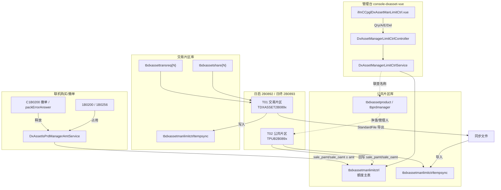
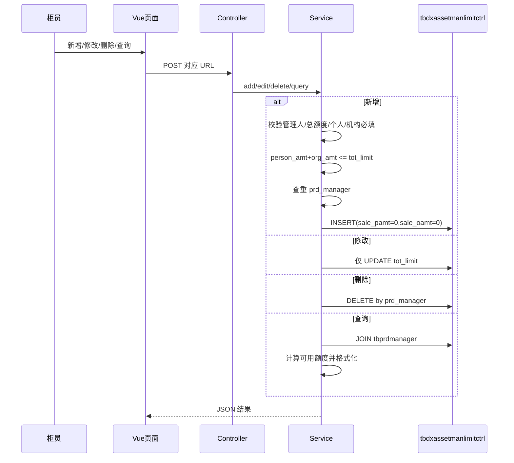
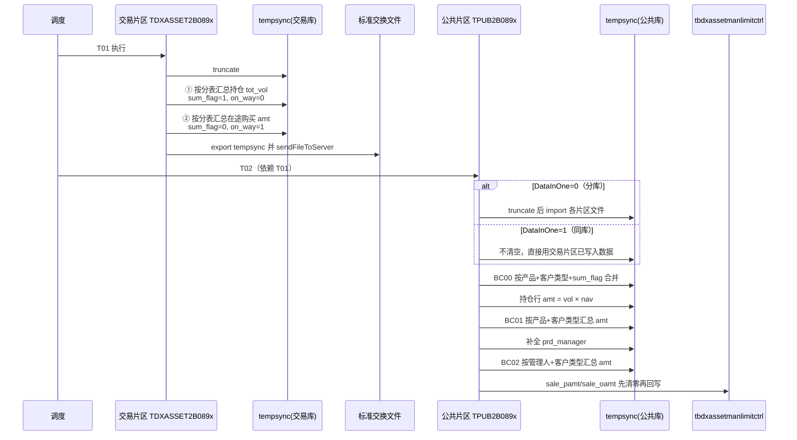
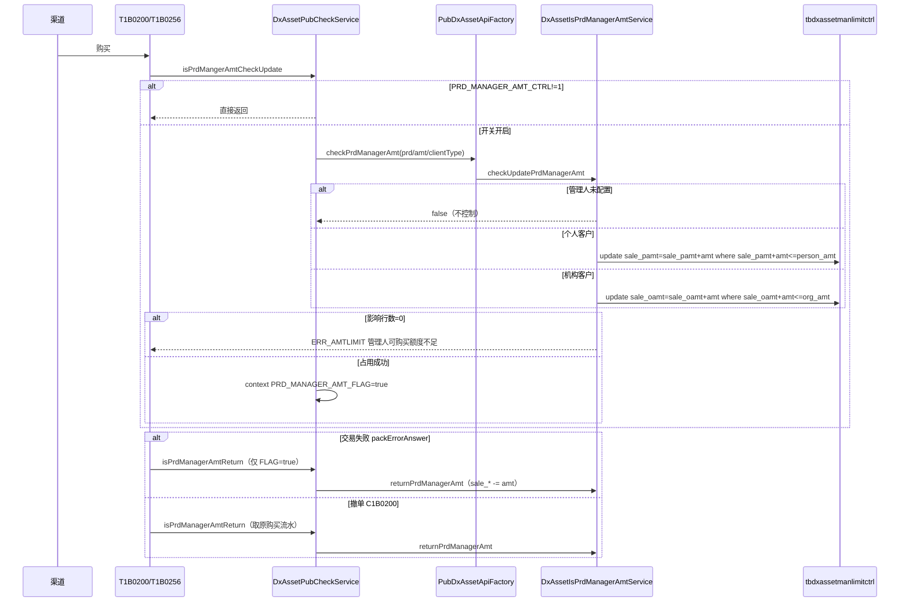

# 资管代销 — 产品管理人总额度控制 业务说明

| 项目 | 内容 |
|------|------|
| 子系统 | dxasset（资管代销，belong_type=7，prd_type=B） |
| 标准/个性化 | 标准功能（任务单归属河北银行引入） |
| 文档版本 | V1.3 |
| 文档日期 | 20260807 |
| 任务单号 | T202606291070 / TB202608043845 / TB202608043845-1 |
| 需求编号 | 202605023001 / 202608030392 |
| IFMS 版本 | IFMS6.0V202607.03.000 |
| 修改人 | zhoufz |
| 修订说明 | V1.3 补充 2B0892/2B0893 片区间 StandardFile 文件传输配置（命名规则、路径、INNER_FILE_CONFIG）；V1.2 补充联机占用释放 |

---

# 一、总体设计

## 1.1 需求摘要

- **背景**：银行需按「产品管理人」维度控制代销资管计划的销售规模，并区分个人客户、机构客户可用额度；已销售额度需随持仓与在途购买变化定期重算。
- **目标**：
  1. 管理台维护管理人总额度、个人/机构额度上限；
  2. 日启/日终批量按「持仓市值 + 在途购买金额」重算个人/机构已销售额度；
  3. 列表展示可用额度（总额度 − 已销售，下限 0）。
- **范围（已实现）**：管理台 CRUD、DDL 表结构、批量 2B0892/2B0893（交易片区汇总导出 + 公共片区汇总回写）、**联机购买实时占用/释放 `sale_pamt`/`sale_oamt`**（`DxAssetIsPrdManagerAmtService`，对齐基金 `DxFundIsPrdManagerAmtService`）。
- **不在现网代码中（需关注）**：
  - 菜单 `tsys_menu/tsys_trans/tsys_subtrans`、调度 `tbschedule*`、`tbtrans` 的增量 SQL（当前 spsql 中未检索到完整下发，见「待确认事项」；河北银行脚本已含联机开关参数 `PRD_MANAGER_AMT_CTRL`）。

## 1.2 与现网能力关系

| 能力点 | 现网落点 | 说明 |
|--------|----------|------|
| 管理台设置 | `DxAssetManagerLimitCtrl*` + Vue | 按管理人维护额度参数 |
| 日启重算已用额度 | `T2B0892` 交易片区 + 公共片区 | 对齐基金 `210892` |
| 日终重算已用额度 | `T2B0893` 交易片区 + 公共片区 | 对齐基金 `210893` |
| 联机占用/释放 | `DxAssetIsPrdManagerAmtService` + `1B0200/1B0256/C1B0200` | 按客户类型更新 `sale_pamt`/`sale_oamt`；参数 `PRD_MANAGER_AMT_CTRL` |
| 额度主表 | `tbdxassetmanlimitctrl`（公共库） | 主键 `prd_manager` |
| 清算临时表 | `tbdxassetmanlimitctrltempsync`（公共库+交易库） | 片区间文件交换载体 |
| 基金同类功能 | `tbdxfundmanlimitctrl` + `210892/210893` | 基金为总额度单字段；资管拆个人/机构 |
| 江苏银行额度控制 | `tbdxassetlimitctrljsyh` + `2B9026/2B9027` | **另一套** TA/产品属性额度，勿与本功能混淆 |

## 1.3 总体方案



**核心思路**：额度上限由管理台人工维护；已用额度由日启/日终批量全量重算回写主表；日间购买在参数开启且管理人已配置时，**按客户类型实时原子占用/释放** `sale_pamt`/`sale_oamt`（与产品额度并行，任一超限拒绝）。

## 1.4 关键业务流程

### 流程1：管理台维护额度



- **正常路径**：字段齐全且个人+机构 ≤ 总额度；同一管理人仅一条记录。
- **异常路径**：未上送必填字段、个人+机构超总额度、记录已存在、DB 异常 → `BizBussinessException`。

### 流程2：日启/日终更新已用额度（数据流转详解）

日启 `2B0892` 与日终 `2B0893` **业务算法相同**，仅触发批次不同（日启组 / 日终组）。



#### 步骤级数据含义

| 阶段 | table_num / 标志 | 数据内容 | 金额口径 |
|------|------------------|----------|----------|
| 交易片区① | 分表号 `1..N`，`sum_flag=1` | `tbdxassetshare{N}` 按 `prd_code+client_type` 汇总 `tot_vol` | `vol` 有值，`amt=0`（待公共片区乘净值） |
| 交易片区② | 分表号，`sum_flag=0`，`on_way_trans_flag=1` | `tbdxassettransreq{N}` 在途购买按产品+客户类型汇总 `amt` | 直接金额 |
| 公共 BC00 | `BC00` | 多片区/多分表合并到产品+客户类型+sum_flag | sum(vol)/sum(amt) |
| 净值转换 | 仍为 BC00 中 `sum_flag=1` 行 | `amt = vol * tbdxassetproduct.nav` | 持仓变市值 |
| 公共 BC01 | `BC01` | 产品+客户类型维度合计（市值+在途金额） | sum(amt) |
| 公共 BC02 | `BC02` | **管理人 + 客户类型** 合计 | sum(amt) |
| 回写主表 | — | 个人客户 → `sale_pamt`；机构客户 → `sale_oamt` | 全量清零后按存在行更新 |

#### 在途购买交易码

参数 `REALBUYTRANSCODE`（资管子系统），缺省：

`~1B0200~1B0256~2B0208~2B0216~2B0217`

流水状态纳入统计：`'0','1','5','P','p','A','E'`（受理/预受理等未确认状态）。

#### 可用额度（仅展示计算，不落库）

```
person_avail_amt = max(person_amt - sale_pamt, 0)
org_avail_amt    = max(org_amt - sale_oamt, 0)
```

### 流程3：联机购买实时占用 / 失败与撤单释放



**联机校验公式（与需求一致，落库实现为原子 UPDATE）**：

```
个人：sale_pamt(已含保有市值+在途，由批量维护并日间累加) + 本次购买金额 ≤ person_amt
机构：sale_oamt + 本次购买金额 ≤ org_amt
```

未配置管理人额度记录 → 不控制；与产品额度（`issamt`）并行，**任一超限交易失败**。

## 1.5 接口与交易清单

| 类型 | 码/菜单 | 名称 | 片区 | 说明 |
|------|---------|------|------|------|
| 管理台 | `ifmCCpglDxAssetManLimitCtrlQry` | 查询 | 管理台→公共库 | GET/POST 分页 |
| 管理台 | `ifmCCpglDxAssetManLimitCtrlA` | 新增 | 同上 | |
| 管理台 | `ifmCCpglDxAssetManLimitCtrlE` | 修改 | 同上 | 仅改 `tot_limit` |
| 管理台 | `ifmCCpglDxAssetManLimitCtrlDel` | 删除 | 同上 | 支持批量 |
| 批量 | `2B0892` / Function：`DXASSET2B0892`+`PUB2B0892` | 日启更新管理人已用额度 | 交易+公共 | Bean：`TDXASSET2B0892HSAdapter` / `TPUB2B0892HSAdapter` |
| 批量 | `2B0893` / Function：`DXASSET2B0893`+`PUB2B0893` | 日终更新管理人已用额度 | 交易+公共 | Bean：`TDXASSET2B0893HSAdapter` / `TPUB2B0893HSAdapter` |
| 联机 | `1B0200` / `1B0256` | 购买占用管理人额度 | 交易→公共 API | `isPrdMangerAmtCheckUpdate` |
| 联机 | `C1B0200` / `packErrorAnswer` | 撤单或失败释放 | 同上 | `isPrdManagerAmtReturn` |
| 公共 API | `/dxassetisprdmanageramt/checkprdmanageramt` | 占用 | 公共片区 | `DxAssetIsPrdManagerAmtApi` |
| 公共 API | `/dxassetisprdmanageramt/returnPrdManagerAmt` | 释放 | 公共片区 | 同上 |

## 1.6 参数与字典

| 参数/字典 | 含义 | 默认/取值 | 说明 |
|-----------|------|-----------|------|
| `REALBUYTRANSCODE` | 资管 | 计入在途/联机占用的购买类交易码 | `1B0200,1B0256,2B0208`（现场可能用 `~` 分隔） |
| `PRD_MANAGER_AMT_CTRL` | 资管 `belong_type=6` | 是否启用管理人额度联机占用/释放：0-关，1-开 | 默认 `0`；河北银行增量下发 `1` |
| `DataInOne` | 公共 | 交易/公共是否同库 | 0/1 |
| `K_KHLX` | 字典 | 客户类型：`0` 机构 / `1` 个人 | 回写与联机分支 `sale_oamt`/`sale_pamt` |
| `K_HZBZ` | 字典 | 汇总标志 | tempsync.sum_flag |

> 联机占用另受「是否配置 `tbdxassetmanlimitctrl` 行」约束：未配置管理人不控制。

---

# 二、模块设计（现网落点说明）

> 本章描述**已落地代码**的职责与数据行为，便于联调/测试/补脚本，非新增改造清单。

## 2.1 管理台 — 产品管理人总额度设置

| 项 | 内容 |
|----|------|
| 涉及文件 | `lcpt-web-manager-dxasset-core/.../DxAssetManagerLimitCtrlController.java`<br>`.../IDxAssetManagerLimitCtrlService.java`<br>`.../DxAssetManagerLimitCtrlService.java`<br>`.../DxAssetManagerLimitCtrlDto.java`<br>前端：`console-dxasset-vue/.../ifmCCpglDxAssetManLimitCtrl.vue`<br>路由：`router/modules/pubRouter.js` |
| 菜单路径 | 产品管理 → 产品销售参数设置 → **产品管理人总额度设置** |
| 表 | `tbdxassetmanlimitctrl` |

### URL 与权限

| 操作 | URL | 权限码 |
|------|-----|--------|
| 查询 | `/ifmCCpglDxAssetManLimitCtrl/ifmCCpglDxAssetManLimitCtrlQry` | `…$ifmCCpglDxAssetManLimitCtrlQry` |
| 新增 | `/ifmCCpglDxAssetManLimitCtrl/ifmCCpglDxAssetManLimitCtrlA` | `…$ifmCCpglDxAssetManLimitCtrlA` |
| 修改 | `/ifmCCpglDxAssetManLimitCtrl/ifmCCpglDxAssetManLimitCtrlE` | `…$ifmCCpglDxAssetManLimitCtrlE` |
| 删除 | `/ifmCCpglDxAssetManLimitCtrl/ifmCCpglDxAssetManLimitCtrlDel` | `…$ifmCCpglDxAssetManLimitCtrlDel` |

### 业务规则

1. **新增必填**：`prd_manager`、`tot_limit`、`person_amt`、`org_amt`；`sale_pamt`/`sale_oamt` 初始 0。
2. **约束**：`person_amt + org_amt ≤ tot_limit`（前端+后端双校验）。
3. **唯一性**：同一 `prd_manager` 不可重复。
4. **修改**：仅允许改 `tot_limit`；个人/机构额度、管理人代码只读。
5. **查询展示字段**：管理人代码/名称、总额度、个人/机构总额度、已销售、可用（计算列），金额格式化 `*_name`。

### 前端字段

| 界面字段 | 绑定键 | 备注 |
|----------|--------|------|
| 管理人代码 | prdManager | auto-select `/ifmCPrdManager/ifmCPrdManagerQuery` |
| 总额度 | totLimit | 新增/修改可编 |
| 个人客户总额度 | personAmt | 仅新增可编 |
| 机构客户总额度 | orgAmt | 仅新增可编 |
| 已销售/可用 | salePamtName 等 | 只读展示 |

## 2.2 批量节点 2B0892 — 日启更新管理人已用额度

| 项 | 内容 |
|----|------|
| 涉及文件 | 交易：`.../dxasset/batch/adapter/T2B0892/T2B0892HSAdapter.java`（`@Service("TDXASSET2B0892HSAdapter")`）<br>公共：`.../dxasset/pub/batch/adapter/T2B0892/T2B0892HSAdapter.java`（`@Service("TPUB2B0892HSAdapter")`） |
| 建议调度 | `J2B0892` → T01=`DXASSET2B0892` → T02=`PUB2B0892`（依赖 T01） |
| 建议挂接 | 日启组（参考基金挂行情导入后 / 日启末）；`sche_group_code` 现场配置 |

**交易片区逻辑摘要**：

1. `truncate tbdxassetmanlimitctrltempsync`
2. 遍历分表，插入持仓汇总（`tot_vol>0.0001`）
3. 遍历分表，插入在途购买汇总（`REALBUYTRANSCODE` + 指定 status）
4. `StandardFileWriter` 导出并 `sendFileToServer`

**公共片区逻辑摘要**：见 1.4 流程2；最终：

```sql
update tbdxassetmanlimitctrl set sale_pamt=0, sale_oamt=0;
-- 再按 BC02 中 client_type=个人/机构 分别回写 sale_pamt / sale_oamt
```

## 2.3 批量节点 2B0893 — 日终更新管理人已用额度

| 项 | 内容 |
|----|------|
| 涉及文件 | 交易/公共 `T2B0893HSAdapter`（Bean：`TDXASSET2B0893HSAdapter` / `TPUB2B0893HSAdapter`） |
| 算法 | 与 2B0892 **相同** |
| 建议调度 | `J2B0893`；挂日终组、建议在 TA 清算相关节点之后（对齐基金说明） |

## 2.4 联机购买占用与释放 — 产品管理人总额度

| 项 | 内容 |
|----|------|
| 接口定义 | `IDxAssetPubCheck.isPrdMangerAmtCheckUpdate` / `isPrdManagerAmtReturn` |
| 交易实现 | `DxAssetPubCheckService`（同上两方法） |
| 公共 Service | `lcpt-dxasset-pub-core/.../DxAssetIsPrdManagerAmtService.java`<br>`.../IDxAssetIsPrdManagerAmtService.java` |
| 公共 API | `lcpt-dxasset-pub-api/.../IDxAssetIsPrdManagerAmtApi.java`<br>`lcpt-dxasset-pub-apiservice/.../DxAssetIsPrdManagerAmtApi.java` |
| 工厂 | `PubDxAssetServiceFactory.getIsPrdManagerAmtService()`<br>`PubDxAssetApiFactory.checkPrdManagerAmt` / `returnPrdManagerAmt` |
| 调用点 | `T1B0200HSAdapter`（产品额度等校验后占用；`packErrorAnswer` 释放）<br>`T1B0256HSAdapter`（同上）<br>`C1B0200`（撤单 `toLocal` 释放，不依赖 FLAG） |
| 参数 | `PRD_MANAGER_AMT_CTRL`（`IDxAssetParamConstant`）；`DxAssetParamUtil.getAssetSysParamValue`（`K_GSXT.GSXT_ASSET`/`belong_type=6`）；脚本 `IFMS6.0V202607.03.000-BANK-hbyh.sql` |
| 表 | `tbdxassetmanlimitctrl.sale_pamt` / `sale_oamt` / `person_amt` / `org_amt` |
| 上下文标志 | `PRD_MANAGER_AMT_FLAG`（Boolean）：占用成功为 `true`，供失败回退判断 |

### 2.4.1 调用时序与挂接点

| 交易 | 阶段 | 方法 | 条件 |
|------|------|------|------|
| `1B0200` | 本地校验（`issamtAndPettynum…`、`assetQuotaCheckUpdate` 之后） | `isPrdMangerAmtCheckUpdate` | 无额外 FLAG |
| `1B0200` | `packErrorAnswer` | `isPrdManagerAmtReturn` | 仅当 `PRD_MANAGER_AMT_FLAG==true` |
| `1B0256` | 额度校验之后 | `isPrdMangerAmtCheckUpdate` | 同上 |
| `1B0256` | `packErrorAnswer` | `isPrdManagerAmtReturn` | 仅当 `PRD_MANAGER_AMT_FLAG==true` |
| `C1B0200` | `toLocal`（`assetQuotaReturn` 之后） | `isPrdManagerAmtReturn` | 不判断 FLAG（撤单必释放） |

调用链：

```
HSAdapter
  → DxAssetServiceFactory.getDxAssetPubCheck().isPrdMangerAmtCheckUpdate / isPrdManagerAmtReturn
    → PubDxAssetApiFactory.checkPrdManagerAmt / returnPrdManagerAmt   （Feign 公共片区）
      → DxAssetIsPrdManagerAmtApi
        → DxAssetIsPrdManagerAmtService.checkUpdatePrdManagerAmt / returnPrdManagerAmt
          → UPDATE tbdxassetmanlimitctrl
```

### 2.4.2 `isPrdMangerAmtCheckUpdate`（占用入口）

实现类：`DxAssetPubCheckService`。

| 步骤 | 逻辑 |
|------|------|
| 1 开关 | `PRD_MANAGER_AMT_CTRL` ≠ `1` → **直接 return**（不占用） |
| 2 空保护 | `transPub` / `transReq` 为空 → return |
| 3 组装金额 | 交易码以 `2` 开头（批量类）：`amt/vol` 取自 `transReq`；否则取请求包 `ITag.Amt` / `ITag.Vol` |
| 4 组装键 | `prdCode`、`transCode` 取自 `transReq`；`clientType` 优先 `transReq`，空则回退 `client.clientType` |
| 5 交易过滤 | 仅当 `transCode` 落在 `REALBUYTRANSCODE`（缺省 `1B0200,1B0256,2B0208`）**或** `1B0205` 时才调用公共占用 |
| 6 远程占用 | `PubDxAssetApiFactory.checkPrdManagerAmt(apiParamPub)` |
| 7 置标志 | `context.setGlobal("PRD_MANAGER_AMT_FLAG", flag)`；`flag=true` 表示本次实际占用成功 |

> 注意：方法名拼写为 `isPrdMangerAmtCheckUpdate`（Manger 少一个 a），与接口一致，调用勿写错。

### 2.4.3 `isPrdManagerAmtReturn`（释放入口）

| 步骤 | 逻辑 |
|------|------|
| 1 开关 | `PRD_MANAGER_AMT_CTRL` ≠ `1` → return |
| 2 空保护 | `transPub` / `transReq` 为空 → return |
| 3 金额来源分支 | **`transCode == 1B0219`（撤单）**：从 `context.getGlobal(TRANSREQ_KEY)` 取**原购买流水**的 amt/vol/prdCode/transCode/clientType；原流水为空则 return。<br>**其他**（含购买失败回退）：用当前 `transReq` 的 amt/vol/prd/clientType（clientType 可回退 Client） |
| 4 远程释放 | `PubDxAssetApiFactory.returnPrdManagerAmt`；业务异常仅记 ERROR 日志（不向外抛，避免掩盖原失败原因） |

### 2.4.4 公共片区 `DxAssetIsPrdManagerAmtService` 落库规则

**占用金额 `calcOccupyAmt`**：

| 交易码 | 占用/释放金额 |
|--------|----------------|
| 落在 `REALBUYTRANSCODE` | `apiParamPub.amt` |
| `1B0205`（份额类） | `vol × product.nav` |
| 其他 | 默认 `amt` |

**占用前短路（返回 false，不抛错）**：产品无管理人、占用金额 ≤ 0、`tbdxassetmanlimitctrl` 无该 `prd_manager` 行。  
**占用失败（抛错）**：客户类型空/非法；原子 UPDATE 影响行数 = 0 → `ERR_AMTLIMIT`「管理人可购买额度不足」；SQL 异常 → 同错误码「管理人额度占用失败」。

### 占用 SQL（原子）

```sql
-- 个人 K_KHLX='1'
update tbdxassetmanlimitctrl set sale_pamt = sale_pamt + ?
 where prd_manager = ? and sale_pamt + ? <= person_amt;

-- 机构 K_KHLX='0'
update tbdxassetmanlimitctrl set sale_oamt = sale_oamt + ?
 where prd_manager = ? and sale_oamt + ? <= org_amt;
```

影响行数 `0` → 抛 `IErrMsg.ERR_AMTLIMIT`「管理人可购买额度不足」。  
`count(*)=0`（未配置）→ 返回 `false`，不控制、不置 `PRD_MANAGER_AMT_FLAG`。

### 释放 SQL

```sql
update tbdxassetmanlimitctrl set sale_pamt = sale_pamt - ? where prd_manager = ?;  -- 个人
update tbdxassetmanlimitctrl set sale_oamt = sale_oamt - ? where prd_manager = ?;  -- 机构
```

释放侧：客户类型空/非法、未配置管理人、金额 ≤ 0 → 记日志并返回 false（不抛）；SQL 异常才抛 `ERR_AMTLIMIT`。

### 2.4.5 日间占用与批量重算的关系

```
日启/日终 2B0892/2B0893：按「持仓市值 + 在途购买」全量重算 → 覆盖 sale_pamt/sale_oamt
日间联机：在主表已用额度上 ± 本次购买金额（原子条件更新）
```

因此：跑批后主表与「持仓+在途」对齐；跑批前的日间占用依赖主表当前值防超卖；窗口内短暂不一致属预期，依赖下一次跑批纠偏。

### 与「资管额度控制」ASSET_QUOTA_CTRL 的区别

| 项 | `ASSET_QUOTA_CTRL` / `DxAssetQuotaControlService` | 本功能 `PRD_MANAGER_AMT_CTRL` |
|----|---------------------------------------------------|-------------------------------|
| 用途 | 晋商等个性化资管额度（标准空实现） | 产品管理人个人/机构总额度 |
| 表 | 个性化 | `tbdxassetmanlimitctrl` |
| 调用 | `assetQuotaCheckUpdate` / `assetQuotaReturn` | `isPrdMangerAmtCheckUpdate` / `isPrdManagerAmtReturn` |
| 上下文 FLAG | `ASSET_QUOTA_FLAG` | `PRD_MANAGER_AMT_FLAG` |

## 2.5 数据库与脚本

### 2.5.1 DDL（已落地）

**公共库**（主表 + 临时表）：

| 脚本 | 表 |
|------|-----|
| `spsql/spsql-dxasset/IFMS6.0V202607.03.000/pub/dxasset/IFMS6.0V202607.03.000.mysql.DDL.sql` | `tbdxassetmanlimitctrl` + `tbdxassetmanlimitctrltempsync` |
| 同目录 `.ob.DDL.sql` / `.ora.DDL.sql` / `.pg.DDL.sql` | 同上 |

**交易库**（仅临时表）：

| 脚本 | 表 |
|------|-----|
| `spsql/spsql-dxasset/IFMS6.0V202607.03.000/trans/dxasset/IFMS6.0V202607.03.000.{mysql,ob,ora,pg}.DDL.sql` | `tbdxassetmanlimitctrltempsync` |

#### 表结构：`tbdxassetmanlimitctrl`（公共）

| 字段 | 类型 | 说明 |
|------|------|------|
| prd_manager | varchar(18) PK | 产品管理人代码 |
| tot_limit | numeric(18,2) | 总额度 |
| person_amt | numeric(18,2) | 个人客户总额度 |
| org_amt | numeric(18,2) | 机构客户总额度 |
| sale_pamt | numeric(18,2) | 个人已销售额度（日启/日终批量全量回写；日间联机 ±） |
| sale_oamt | numeric(18,2) | 机构已销售额度（日启/日终批量全量回写；日间联机 ±） |

#### 表结构：`tbdxassetmanlimitctrltempsync`（公共+交易）

| 字段 | 说明 |
|------|------|
| prd_manager | 管理人（公共汇总阶段补全） |
| prd_code | 产品代码 |
| client_type | 客户类型 K_KHLX |
| sum_flag | 0-金额汇总 / 1-份额汇总 |
| on_way_trans_flag | 在途标识 |
| vol / amt | 份额 / 金额 |
| area_id | 片区号 |
| table_num | 分表号或 BC00/BC01/BC02 |
| **PK** | (prd_manager, prd_code, client_type, sum_flag, on_way_trans_flag, area_id, table_num) |

### 2.5.2 菜单脚本（现网缺失 — 推荐补丁）

当前 `spsql` **未检索到** `ifmCCpglDxAssetManLimitCtrl` 菜单 SQL。参考基金苏州银行脚本与效能单描述，建议写入例如：

`spsql/spsql-dxasset/IFMS6.0V202607.03.000/pub/dxasset/IFMS6.0V202607.03.000-BANK-hbyh.sql`（或标准脚本，按项目约定）

```sql
-- add by zhoufz T202606291070 IFMS6.0V202607.03.000 产品管理人总额度设置菜单 beg
delete from tsys_menu where menu_code = 'ifmCCpglDxAssetManLimitCtrl';
delete from tsys_trans where trans_code = 'ifmCCpglDxAssetManLimitCtrl';
delete from tsys_subtrans where trans_code = 'ifmCCpglDxAssetManLimitCtrl';

insert into tsys_menu (menu_code, kind_code, trans_code, sub_trans_code, menu_name, menu_arg, menu_icon,
  window_type, tip, hot_key, parent_code, order_no, open_flag, tree_idx, remark, window_model)
values ('ifmCCpglDxAssetManLimitCtrl', 'console-dxasset-vue', 'ifmCCpglDxAssetManLimitCtrl',
  'ifmCCpglDxAssetManLimitCtrlQry', '产品管理人总额度设置', null, 'images/ifm/cpgl/baseMng.png',
  null, null, null, 'ifmCCpglDxAssetXs', '5', null,
  '/console-dxasset-vue/ifmDxAssetPrdManage/ifmCCpglDxAssetXs/ifmCCpglDxAssetManLimitCtrl/', null, null);

insert into tsys_trans (trans_code, trans_name, kind_code, model_code, remark, ext_field_1, ext_field_2, ext_field_3)
values ('ifmCCpglDxAssetManLimitCtrl', '产品管理人总额度设置', 'ifmmanage', '5', null, null, null, null);

insert into tsys_subtrans (trans_code, sub_trans_code, sub_trans_name, rel_serv, rel_url, ctrl_flag, login_flag, remark, ext_field_1, ext_field_2, ext_field_3)
values ('ifmCCpglDxAssetManLimitCtrl', 'ifmCCpglDxAssetManLimitCtrlQry', '产品管理人总额度设置查询', ' ', ' ', '0', '1', ' ', '11', ' ', ' ');
insert into tsys_subtrans (trans_code, sub_trans_code, sub_trans_name, rel_serv, rel_url, ctrl_flag, login_flag, remark, ext_field_1, ext_field_2, ext_field_3)
values ('ifmCCpglDxAssetManLimitCtrl', 'ifmCCpglDxAssetManLimitCtrlA', '产品管理人总额度设置新增', ' ', ' ', '0', '1', ' ', '11', ' ', ' ');
insert into tsys_subtrans (trans_code, sub_trans_code, sub_trans_name, rel_serv, rel_url, ctrl_flag, login_flag, remark, ext_field_1, ext_field_2, ext_field_3)
values ('ifmCCpglDxAssetManLimitCtrl', 'ifmCCpglDxAssetManLimitCtrlE', '产品管理人总额度设置修改', ' ', ' ', '0', '1', ' ', '11', ' ', ' ');
insert into tsys_subtrans (trans_code, sub_trans_code, sub_trans_name, rel_serv, rel_url, ctrl_flag, login_flag, remark, ext_field_1, ext_field_2, ext_field_3)
values ('ifmCCpglDxAssetManLimitCtrl', 'ifmCCpglDxAssetManLimitCtrlDel', '产品管理人总额度设置删除', ' ', ' ', '0', '1', ' ', '11', ' ', ' ');
-- add by zhoufz T202606291070 IFMS6.0V202607.03.000 产品管理人总额度设置菜单 end
```

> `parent_code` / `tree_idx` / `order_no` 需与现场「产品销售参数设置」父菜单实际编码核对后调整。

### 2.5.3 调度脚本（现网缺失 — 推荐补丁）

对齐基金 `J210892/J210893` 与资管其他双片区节点（如 `J2B0751`）模式：

```sql
-- add by zhoufz T202606291070 IFMS6.0V202607.03.000 日启/日终更新管理人已用额度调度 beg

-- ***** 日启 J2B0892 *****
delete from tbtrans where trans_code = '2B0892';
insert into tbtrans (trans_code, trans_name, enable_flag, channels, host_online, trans_type, monitor_flag, log_level, cancel_flag, erase_flag, mon_trans_type, reserve1, reserve2, reserve3, prd_type)
values ('2B0892', '日启更新管理人已用额度', '1', '01234569G', '0', '4', '0', '2', '0', '0', '5', '01', ' ', ' ', '0');

delete from tbschedulejob where sche_job_code = 'J2B0892';
-- sche_group_code / sche_parent_job_code 现场配置（建议日启组，挂行情导入后）
insert into tbschedulejob (sche_group_code, sche_job_code, sche_job_name, sche_parent_job_code, sche_job_isuse, sche_up_job_code, bank_no, ta_code, sche_job_url, sche_job_pause, sche_is_refresh)
values ('35', 'J2B0892', '日启更新管理人已用额度', 'J3501', '1', '', NULL, '000000', NULL, '0', ' ');

delete from tbscheduletask where sche_job_code = 'J2B0892';
insert into tbscheduletask (sche_job_code, sche_task_code, sche_task_name, sche_parent_task_code, sche_task_redo, sche_task_timeout, sche_task_retrycount, sche_task_isuse, sche_task_ishide, sche_task_memo, sche_task_dependencies, function_id, bank_no, ta_code)
values ('J2B0892', 'J2B0892T01', '日启更新管理人已用额度：DXASSET2B0892', NULL, '1', 1000000, NULL, '1', NULL, NULL, NULL, 'DXASSET2B0892', '000', '000000');
insert into tbscheduletask (sche_job_code, sche_task_code, sche_task_name, sche_parent_task_code, sche_task_redo, sche_task_timeout, sche_task_retrycount, sche_task_isuse, sche_task_ishide, sche_task_memo, sche_task_dependencies, function_id, bank_no, ta_code)
values ('J2B0892', 'J2B0892T02', '公共片区日启更新管理人已用额度：PUB2B0892', 'J2B0892T01', '1', 1000000, NULL, '1', NULL, NULL, NULL, 'PUB2B0892', '000', '000000');

delete from tbscheduletaskregistry where sche_task_code in ('J2B0892T01','J2B0892T02');
insert into tbscheduletaskregistry (sche_task_code, app_name, app_group, app_version, app_url, sche_app_isuse)
values ('J2B0892T01', 'lcpt-dxasset-batch-trans1', 'group', '1.0', '/dxasset/trans/batch', '1');
insert into tbscheduletaskregistry (sche_task_code, app_name, app_group, app_version, app_url, sche_app_isuse)
values ('J2B0892T01', 'lcpt-dxasset-batch-trans2', 'group', '1.0', '/dxasset/trans/batch', '1');
insert into tbscheduletaskregistry (sche_task_code, app_name, app_group, app_version, app_url, sche_app_isuse)
values ('J2B0892T02', 'lcpt-dxasset-pub-batch', 'group', '1.0', '/dxasset/pub/batch', '1');

-- ***** 日终 J2B0893 *****
delete from tbtrans where trans_code = '2B0893';
insert into tbtrans (trans_code, trans_name, enable_flag, channels, host_online, trans_type, monitor_flag, log_level, cancel_flag, erase_flag, mon_trans_type, reserve1, reserve2, reserve3, prd_type)
values ('2B0893', '日终更新管理人已用额度', '1', '01234569G', '0', '4', '0', '2', '0', '0', '5', '01', ' ', ' ', '0');

delete from tbschedulejob where sche_job_code = 'J2B0893';
-- 建议日终组，挂 TA 清算后；父节点现场配置
insert into tbschedulejob (sche_group_code, sche_job_code, sche_job_name, sche_parent_job_code, sche_job_isuse, sche_up_job_code, bank_no, ta_code, sche_job_url, sche_job_pause, sche_is_refresh)
values ('36', 'J2B0893', '日终更新管理人已用额度', 'J3601', '1', '', NULL, '000000', NULL, '0', ' ');

delete from tbscheduletask where sche_job_code = 'J2B0893';
insert into tbscheduletask (sche_job_code, sche_task_code, sche_task_name, sche_parent_task_code, sche_task_redo, sche_task_timeout, sche_task_retrycount, sche_task_isuse, sche_task_ishide, sche_task_memo, sche_task_dependencies, function_id, bank_no, ta_code)
values ('J2B0893', 'J2B0893T01', '日终更新管理人已用额度：DXASSET2B0893', NULL, '1', 1000000, NULL, '1', NULL, NULL, NULL, 'DXASSET2B0893', '000', '000000');
insert into tbscheduletask (sche_job_code, sche_task_code, sche_task_name, sche_parent_task_code, sche_task_redo, sche_task_timeout, sche_task_retrycount, sche_task_isuse, sche_task_ishide, sche_task_memo, sche_task_dependencies, function_id, bank_no, ta_code)
values ('J2B0893', 'J2B0893T02', '公共片区日终更新管理人已用额度：PUB2B0893', 'J2B0893T01', '1', 1000000, NULL, '1', NULL, NULL, NULL, 'PUB2B0893', '000', '000000');

delete from tbscheduletaskregistry where sche_task_code in ('J2B0893T01','J2B0893T02');
insert into tbscheduletaskregistry (sche_task_code, app_name, app_group, app_version, app_url, sche_app_isuse)
values ('J2B0893T01', 'lcpt-dxasset-batch-trans1', 'group', '1.0', '/dxasset/trans/batch', '1');
insert into tbscheduletaskregistry (sche_task_code, app_name, app_group, app_version, app_url, sche_app_isuse)
values ('J2B0893T01', 'lcpt-dxasset-batch-trans2', 'group', '1.0', '/dxasset/trans/batch', '1');
insert into tbscheduletaskregistry (sche_task_code, app_name, app_group, app_version, app_url, sche_app_isuse)
values ('J2B0893T02', 'lcpt-dxasset-pub-batch', 'group', '1.0', '/dxasset/pub/batch', '1');

-- add by zhoufz T202606291070 IFMS6.0V202607.03.000 日启/日终更新管理人已用额度调度 end
```

### 2.5.4 片区间文件传输配置（StandardFile / INNER_FILE_CONFIG）

> **说明**：2B0892/2B0893 片区间交换**不依赖** `tbfiletype` / `tbfileformat`。字段由 `select * from tbdxassetmanlimitctrltempsync` 的 JDBC 元数据动态写出；只需：**临时表 DDL + 调度节点 + `IFMBASEPATH`/`INNER_FILE_CONFIG` 路径与 SFTP**。  
> 当 `DataInOne=1`（交易/公共同库）时，公共片区 `getBnData` 直接 return，**不导不导文件**，本节可忽略。

#### （1）文件命名与内容约定

| 项 | 规则 |
|----|------|
| 命名 | `{表名}~{taCode}~{yyyyMMdd}~{areaId}.txt` |
| 代码 | `StandardFileContext.getFileName(tableName, taCode, initDate, areaId)` |
| 本场景 | 表名=`tbdxassetmanlimitctrltempsync`，`taCode=000000`（`IConstant.DEFAULT_CODE`） |
| 示例（片区1、日期20260807） | `tbdxassetmanlimitctrltempsync~000000~20260807~1.txt` |
| 编码 | UTF-8 |
| 列分隔 | `@%@` |
| 结束符 | `!#@END@#!`（公共导入 `setCheckEndFile(true)`） |

#### （2）路径规则（代码默认）

源码：`ResourceUtil.getLocalInnerFileSendPath` / `getLocalInnerFileReceivePath` / `getRemoteInnerFile*`，`InnerFileType.GENERAL`。

| 方向 | 本地默认路径 | 远端（SFTP） |
|------|--------------|--------------|
| 交易片区导出 EXP | `{IFMBASEPATH}/innerdata/general/000000/send/` | `INNER_FILE_CONFIG[_000000].GENERAL_LPATH`（未配则同默认 recv 结构指向公共侧） |
| 公共片区导入 IMP | `{IFMBASEPATH}/innerdata/general/000000/recv/` | `INNER_FILE_CONFIG[_000000].GENERAL_SPATH`（未配则同默认 send） |

流转：交易片区写本地 `send/` → `sendFileToServer` 推到公共侧 `recv/` → 公共片区从本地 `recv/` 读入（或按 IMP 从远端 `send` 拉取，取决于现场 GENERAL_* 配法）。

#### （3）本机资管批量现有配置（摘自工程）

交易批量（已有 SFTP，未显式配 GENERAL 路径，走默认目录）：

- 文件：`app/lcpt-server/sale/lcpt-dxasset/lcpt-dxasset-trans/lcpt-dxasset-batch-bootstrap/src/main/resources/application.properties`

```properties
lcpt.config.IFMBASEPATH=/home/lcpt60/
lcpt.config.INNER_FILE_CONFIG.ServerIP=10.20.26.47
lcpt.config.INNER_FILE_CONFIG.Port=22
lcpt.config.INNER_FILE_CONFIG.UserID=ifms60-jjzx
lcpt.config.INNER_FILE_CONFIG.Password=********
```

公共批量：

- 文件：`app/lcpt-server/sale/lcpt-dxasset/lcpt-dxasset-pub/lcpt-dxasset-pub-batch-bootstrap/src/main/resources/application.properties`

```properties
lcpt.config.IFMBASEPATH=/home/lcpt60/
```

按默认规则，本机落盘目录为：

| 角色 | 路径 |
|------|------|
| 交易片区本地发送 | `/home/lcpt60/innerdata/general/000000/send/` |
| 公共片区本地接收 | `/home/lcpt60/innerdata/general/000000/recv/` |

> 交易/公共若共用同一 `IFMBASEPATH=/home/lcpt60/`，须保证 SFTP 账号能把交易侧 `send` 文件落到公共侧可读的 `recv`（或通过下方推荐配置显式拆分 pub 根路径）。上线前在服务器创建上述目录并授权运行用户可读写。

#### （4）推荐补全配置（对齐基金 GENERAL 显式路径）

建议在**交易批量** `application.properties`（或 SEE 模板 / 现场配置中心）增加，避免默认路径与公共根目录混淆。参照基金：

`app/lcpt-server/sale/lcpt-dxfund/lcpt-dxfund-trans/lcpt-dxfund-batch-bootstrap/src/main/resources/application.properties`

```properties
# ===== 资管片区根路径（现场按部署调整）=====
# 交易片区：可按片区号区分，如 /home/lcpt60/dxasset/trans-area${AREAID}
lcpt.config.IFMBASEPATH=/home/lcpt60/dxasset/trans-area${AREAID}
# 公共片区根路径（供 INNER_FILE 远端路径引用）
lcpt.config.pub.IFMBASEPATH=/home/lcpt60/dxasset/pub-area0

# ===== 片区间内部文件交换（2B0892/2B0893 StandardFile GENERAL）=====
lcpt.config.INNER_FILE_CONFIG.ServerIP=10.20.26.47
lcpt.config.INNER_FILE_CONFIG.Port=22
lcpt.config.INNER_FILE_CONFIG.UserID=ifms60-jjzx
lcpt.config.INNER_FILE_CONFIG.Password=********

# 交易片区推送到公共片区的接收目录（公共侧 recv）
lcpt.config.INNER_FILE_CONFIG_000000.GENERAL_LPATH=${lcpt.config.pub.IFMBASEPATH}/innerdata/general/000000/recv
# 公共片区取文件的发送目录（公共侧 send；若仅 trans→pub 单向，可与 LPATH 同指向 recv 或按现场约定）
lcpt.config.INNER_FILE_CONFIG_000000.GENERAL_SPATH=${lcpt.config.pub.IFMBASEPATH}/innerdata/general/000000/send
```

公共批量建议：

```properties
lcpt.config.IFMBASEPATH=/home/lcpt60/dxasset/pub-area0
# 若公共侧也需拉文件，可同样配置 INNER_FILE_CONFIG.ServerIP/...
```

物理目录需预先创建（示例）：

```text
/home/lcpt60/dxasset/trans-area1/innerdata/general/000000/send/
/home/lcpt60/dxasset/trans-area2/innerdata/general/000000/send/
/home/lcpt60/dxasset/pub-area0/innerdata/general/000000/recv/
/home/lcpt60/dxasset/pub-area0/innerdata/general/000000/send/
```

#### （5）联调检查清单

1. `DataInOne=0` 时：T01 执行后，交易片区 `send` 目录出现 `tbdxassetmanlimitctrltempsync~000000~{initDate}~{areaId}.txt`。
2. T02 开始前：公共片区 `recv` 已收到各片区同名文件且含结束符。
3. 多片区时文件个数 = `ShardingUtil.getTotAreaNum(CPLX_ZGJH)`。
4. SFTP 连通性：`INNER_FILE_CONFIG.ServerIP/Port/UserID/Password`（密码一般为配置加密串）。
5. `DataInOne=1`：确认无文件动作且公共汇总仍能读到交易片区写入的 tempsync。

### 2.5.5 执行顺序

1. 公共库 DDL：`tbdxassetmanlimitctrl` + `tbdxassetmanlimitctrltempsync`
2. 交易库 DDL：`tbdxassetmanlimitctrltempsync`
3. 菜单 / 子交易 / 权限授权
4. `tbtrans` + 调度 job/task/registry
5. **配置 `IFMBASEPATH` / `INNER_FILE_CONFIG`（及推荐 GENERAL_LPATH/SPATH），创建 send/recv 目录**
6. 部署管理台 + 交易/公共批量包

### 2.5.6 回滚要点

- `drop table` 两张业务表前备份数据；
- 删除对应 `tsys_*`、`tbschedule*`、`tbtrans` 记录；
- 回退 Java/Vue 包；
- 如曾新增 GENERAL 路径配置，恢复原 `application.properties` / 配置中心项。

## 2.6 关联对象与数据依赖

| 对象 | 用途 |
|------|------|
| `tbprdmanager` | 查询联表取 `manager_name` |
| `tbdxassetproduct` | 公共汇总取 `nav`、`prd_manager` |
| `tbdxassetshare{N}` | 持仓份额来源 |
| `tbdxassettransreq{N}` | 在途购买金额来源 |
| `StandardFileReader/Writer` | 分库时片区文件交换（见 **2.5.4** 文件传输配置） |
| `INNER_FILE_CONFIG` / `IFMBASEPATH` | 片区间 GENERAL 路径与 SFTP；本机默认根路径 `/home/lcpt60/` |
| `ShardingUtil` / `DxAssetShardingUtil` | 片区数、分表数 |

## 2.7 与基金管理人额度差异对照

| 对比项 | 基金 | 资管（本功能） |
|--------|------|----------------|
| 主表 | `tbdxfundmanlimitctrl` | `tbdxassetmanlimitctrl` |
| 已用字段 | `tot_sale_amt`（单一） | `sale_pamt` + `sale_oamt`（个人/机构） |
| 批量节点 | 210892 / 210893 | 2B0892 / 2B0893 |
| 联机占用 | 有 `DxFundIsPrdManagerAmtService` + 购买/撤单回退 | **已实现** `DxAssetIsPrdManagerAmtService`（按个人/机构） |
| 控制开关 | `PRD_MANAGER_AMT_CTRL` | **同名**，资管 `belong_type=6` |

## 2.8 文件清单汇总

| 序号 | 路径 | 类型 |
|------|------|------|
| 1 | `.../DxAssetManagerLimitCtrlController.java` | 管理台 |
| 2 | `.../IDxAssetManagerLimitCtrlService.java` | 管理台 |
| 3 | `.../DxAssetManagerLimitCtrlService.java` | 管理台 |
| 4 | `.../DxAssetManagerLimitCtrlDto.java` | 管理台 |
| 5 | `console-dxasset-vue/.../ifmCCpglDxAssetManLimitCtrl.vue` | 前端 |
| 6 | `console-dxasset-vue/router/modules/pubRouter.js` | 路由 |
| 7 | `.../batch/adapter/T2B0892/T2B0892HSAdapter.java` | 交易批量 |
| 8 | `.../batch/adapter/T2B0893/T2B0893HSAdapter.java` | 交易批量 |
| 9 | `.../pub/batch/adapter/T2B0892/T2B0892HSAdapter.java` | 公共批量 |
| 10 | `.../pub/batch/adapter/T2B0893/T2B0893HSAdapter.java` | 公共批量 |
| 11 | `.../DxAssetIsPrdManagerAmtService.java` + Interface | 联机占用/释放 |
| 12 | `.../IDxAssetIsPrdManagerAmtApi.java` + `DxAssetIsPrdManagerAmtApi.java` | Feign/Rest |
| 13 | `PubDxAssetApiFactory` / `PubDxAssetServiceFactory` | 工厂注册 |
| 14 | `DxAssetPubCheckService` / `IDxAssetPubCheck` | 交易侧入口 |
| 15 | `T1B0200HSAdapter` / `T1B0256HSAdapter` / `C1B0200` | 购买占用、失败/撤单释放 |
| 16 | `IDxAssetParamConstant.PRD_MANAGER_AMT_CTRL` | 参数常量 |
| 17 | `spsql-dxasset/.../pub/.../*.DDL.sql`（4 库） | DDL |
| 18 | `spsql-dxasset/.../trans/.../*.DDL.sql`（4 库） | DDL |
| 19 | `IFMS6.0V202607.03.000-BANK-hbyh.sql` | 联机开关参数（已补） |
| 20 | 菜单/调度 SQL | **待补** |

---

## 任务完成总结

### 已完成

- 梳理管理台、日启/日终双片区批量、主表/临时表及完整数据流转（含 BC00→BC02、净值折算、个人/机构回写）。
- **补充联机购买实时占用/释放**：按 `IDxAssetPubCheck.isPrdMangerAmtCheckUpdate` / `isPrdManagerAmtReturn` 梳理开关、交易过滤、`PRD_MANAGER_AMT_FLAG`、撤单 `1B0219` 原流水、公共原子 SQL；挂接 1B0200/1B0256/C1B0200；参数 `PRD_MANAGER_AMT_CTRL`（hbyh 下发 1）。
- **V1.3 补充片区间文件传输配置（2.5.4）**：StandardFile 命名规则、本机 `/home/lcpt60/` 默认路径、`INNER_FILE_CONFIG` 及推荐 GENERAL_LPATH/SPATH（对齐基金）、联调检查清单。
- 汇总已落地 DDL 与相关 Java/Vue 文件；给出菜单与调度推荐脚本。
- 文档路径：`F:\git-tools\tools\src\main\resources\reference\标准-dxasset-产品管理人总额度控制-业务说明-V1.md`

### 待确认事项（需业务/项目组答复）

1. **菜单与调度 SQL** 是否已在其他分支/银行个性化脚本中，还是确实遗漏需按本文 2.5.2/2.5.3 补入？银行代码是否固定 `hbyh`？
2. **批量购买节点**（如 `2B0208`）是否也需挂接管理人额度占用/失败释放（当前仅联机 1B0200/1B0256 + 撤单 C1B0200）？
3. **日启/日终父节点**：`sche_parent_job_code`、`sche_group_code` 现场最终挂接哪一节点？
4. **修改仅改总额度**：个人/机构额度后续是否允许调整？是否需校验「新总额度 ≥ 个人+机构」及「≥ 已销售」？

### 需求可能遗漏

1. 下载导出（基金菜单有 Dl，资管 Vue `isShowDownload=false`）。
2. 联机超限拒绝文案已用 `ERR_AMTLIMIT`「管理人可购买额度不足」，是否需单独错误码。
3. 无管理人额度配置时：联机视为不控制（已实现）。

### 不合理或风险点

1. **批量全量重算**会覆盖日间联机累加的 `sale_*`；日启/日终跑批后与实时占用衔接依赖「持仓+在途」重算口径，窗口内仍可能短暂不一致。
2. 修改 `tot_limit` **未校验**是否小于 `person_amt+org_amt` 或已销售合计。
3. tempsync 主键含 `prd_manager` 等字段，交易片区插入时 `prd_manager` 为空格，依赖公共阶段 update。
4. 江苏银行 `2B9026/2B9027` 为另一额度体系，实施时勿混用表与节点。
5. `ASSET_QUOTA_CTRL` 与 `PRD_MANAGER_AMT_CTRL` 两套开关并存，测试时勿混淆。
6. 本机资管批量仅配了 `INNER_FILE_CONFIG` 主机账号、未显式配 `GENERAL_LPATH/SPATH`，交易/公共共用 `/home/lcpt60/` 时需确认 SFTP 落盘与 recv 目录一致，建议按 2.5.4（4）拆分 pub/trans 根路径。
